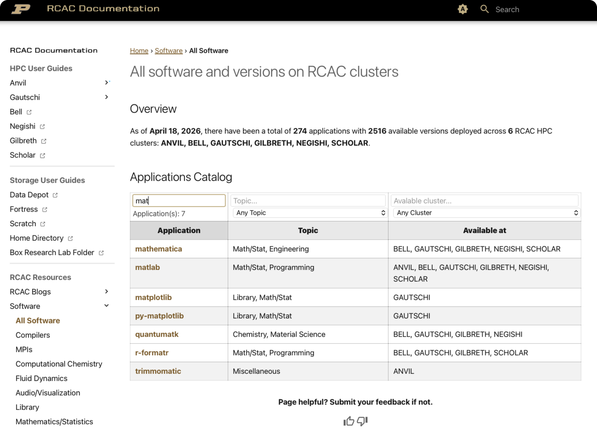

---
date:
  created: 2026-04-20

pin: true

categories:
  - Announcements

title: Introducing New RCAC Documentation Website

slug: rcac-docs-website-intro

tags:
  - Documentation
  - Search
  - User Guide
  - Software Catalog

authors:
  - jin456
---

# Introducing the New RCAC Documentation Website

We are excited to announce the launch of the redesigned **RCAC Documentation Website** — a unified, searchable hub for everything you need to use Purdue's high-performance computing resources. The new site is built around three goals: **find information fast**, **stay current automatically**, and **learn as a community**. Whether you are a first-time user or an experienced researcher, here is what is waiting for you.

<!-- more -->

---

## 1. Find Anything Instantly — Full-Site Search

The search bar in the header searches **every page at once** — user guides, software catalog, datasets, workshops, and blog posts — as you type. Suggestions appear in real time and matching terms are highlighted directly in the results.

!!! note
    Search indexes the full text of every page, including code blocks. Searching for a command like `sbatch`, a package name like `cuda`, or a concept like "interactive job" will surface the exact section that covers it — no browsing required.

---

## 2. HPC User Guides

Every RCAC cluster has its own dedicated guide organized into consistent chapters. e.g. **Overview**, **Accounts**, **Running Jobs**, **File Storage & Transfer**, **FAQ**, etc.

| Cluster User Guide | Notable Hardware |
|---|---|
| [Anvil](/userguides/anvil/) | 128 cores/node, A100 (40GB) and H100 (80GB) GPUs |
| [Gautschi](/userguides/gautschi) | 192 cores/node, L40S (48GB) and H100 (80GB) GPUs |
| [Bell (Under Migration) :octicons-link-external-16:](https://www.rcac.purdue.edu/knowledge/bell)  | 128 cores/node, AMD MI50 (32GB) GPUs |
| [Negishi (Under Migration) :octicons-link-external-16:](https://www.rcac.purdue.edu/knowledge/negishi) | 128 cores/node, AMD MI210 (64GB) GPUs |
| [Gilbreth (Under Migration) :octicons-link-external-16:](https://www.rcac.purdue.edu/knowledge/gilbreth) | Various Nvida GPUs |
| [Scholar (Under Migration) :octicons-link-external-16:](https://www.rcac.purdue.edu/knowledge/scholar) | 168 cores/node, Various Nvida GPUs |

!!! tip "Breadcrumb navigation"
    Every page shows a breadcrumb trail near the top — you always know where you are in the guide and can jump back up in one click.

---

## 3. Always Up-to-Date — Automatic Software & Dataset Pages

One of the biggest pain points with documentation is stale content. The new site solves this with **automated update pipelines**:

- **Software pages** are up-to-date with actual applications/versions across available RCAC clusters — reflects the current state of the system.
- **Dataset pages** are synchronized with the actual data hosting across multiple types of RCAC storage systems. New collections appear as soon as they are ingested; retired datasets are removed automatically.

You will never need to wonder whether the version shown in the docs matches what is actually installed.

---

## 4. Software Catalog with Live Table Filtering

The [Software Catalog](../../software/index.md) lists **200+ packages** across 12 categories: Compilers, MPIs, Chemistry, Fluid Dynamics, Math/Statistics, Engineering, and more.

Every table has a **live filter bar** — start typing a package name, cluster, or version and the rows narrow in real time with no page reload.

---

## 5. A Modern Reading Experience

The site is built on the [Material for MkDocs :octicons-link-external-16:](https://squidfunk.github.io/mkdocs-material/) theme with several quality-of-life improvements. For example:

- **Dark mode / Light mode toggle** — one click in the top navigation bar switches themes. On your first visit, the site automatically matches your operating system's preference.

- **Quick access hero banner** - provide easy access to most frequently used function on the website.

- **Copy button on every code block** — hover over any code snippet and a copy icon appears in the top-right corner.

---

## 6. Workshops & Tutorials

The [Workshops](/workshops) section hosts self-paced learning materials from various RCAC workshops for users at all levels, e.g.:

- [**HPC Exchange**](/workshops/hpc_exchange/) — a four-week series covering Unix fundamentals, cluster architecture, shell scripting, and Slurm job submission
- [**Anvil Kubernetes**](/workshops/kubernetes-tutorial/) — containerized computing on the Anvil composable subsystem
- [**Scientific Visualization with Matplotlib**](/workshops/matplotlib/) — five hands-on modules

We are also continously adding more RCAC workshop materials to the website.

---

## 7. RCAC Blog & Community Comments

The [RCAC Blog](/blog/index.md) is where staff share how-tos, tips, announcements, and deep dives. Posts are organized by **category** and **tag** and are fully searchable.

### Comments powered by Giscus

Every blog post has a **comment section** at the bottom for users to discuss on the blog topic.

To join the conversation:

1. Scroll to the bottom of any blog post
2. Sign in with a **free GitHub account**
3. Post your comment or react with 👍 ❤️ 🎉

!!! note
    A GitHub account is required to post. [Signing up :octicons-link-external-16:](https://github.com/signup) is free and takes under a minute.

---

## 8. Get Help & Give Feedback

**Support channels** are accessible from every page via the navigation footer:

- **Email:** [rcac-help@purdue.edu :octicons-link-external-16:](mailto:rcac-help@purdue.edu)
- **Discord:** community server for peer and staff support
- **GitHub Repo:** [PurdueRCAC/RCAC-Docs :octicons-link-external-16:](https://github.com/PurdueRCAC/RCAC-Docs) — open an issue or browse existing ones

**Per-page feedback widget** — at the bottom of every documentation page you will find a **👍 / 👎 rating**.

- **👍** — tells us the page was helpful
- **👎** — tells us the page needs improvement and directs to a pre-filled GitHub issue with the page URL already embedded. Describe what was unclear or incorrect and submit.

---

Ready to explore? Start at the [homepage](/), search for your cluster or a tool you use, and let us know what you think.
