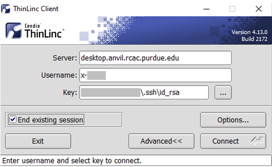
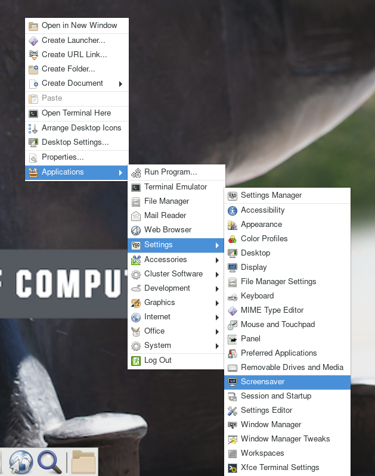
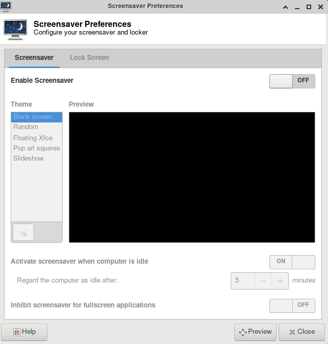
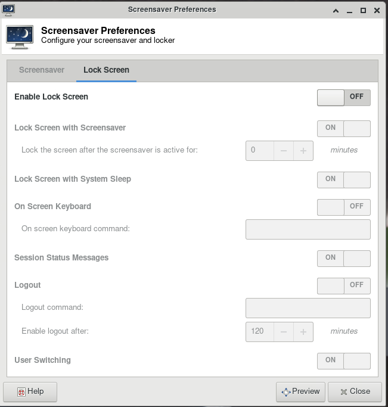

---
tags:
  - Anvil
authors:
  - jin456
cluster: Anvil
---

# Frequently Asked Questions

Some common questions, errors, and problems are categorized below.

## Logging In & Accounts

### Can I use browser-based Thinlinc to access Anvil?

Password based access through browser-based Thinlinc to Anvil is not supported at this moment. Please use Thinlinc Client instead.

For your first time login to Anvil, you will have to login to Open OnDemand with your ACCESS username and password to start an anvil terminal and then set up SSH keys. Then you are able to use your native Thinlic client to access Anvil with SSH keys. Follow our [user guide section](getting-started.md) to set this up. 

### What if my ThinLinc screen is locked?

#### Problem

Your ThinLinc desktop is locked after being idle for a while, and it asks for a password to refresh it, but you do not know the password (neither do the Anvil staff).

<figure markdown="span">
    
    <figcaption>In the default settings, the "screensaver" and "lock screen" are turned on, so if your desktop is idle for more than 5 minutes, your screen might be locked.</figcaption>
</figure>

#### Solution

If your screen is locked, close the ThinLinc client, reopen the client login popup, and select `End existing session`.

<figure markdown="span">
    
    <figcaption>Select "End existing session" and try "Connect" again.</figcaption>
</figure>

To permanently avoid screen lock issue, right click desktop and select `Applications`, then `settings`, and select `Screensaver`.

<figure markdown="span">
    
    <figcaption>Select "Applications", then "settings", and select "Screensaver".</figcaption>
</figure>

Under **Screensaver**, turn off the `Enable Screensaver`, then under **Lock Screen**, turn off the `Enable Lock Screen`, and close the window.

<figure markdown="span">
    
    <figcaption>Under "Screensaver" tab, turn off the "Enable Screensaver" option.</figcaption>
</figure>

<figure markdown="span">
    
    <figcaption>Under "Lock Screen" tab, turn off the "Enable Lock Screen" option.</figcaption>
</figure>