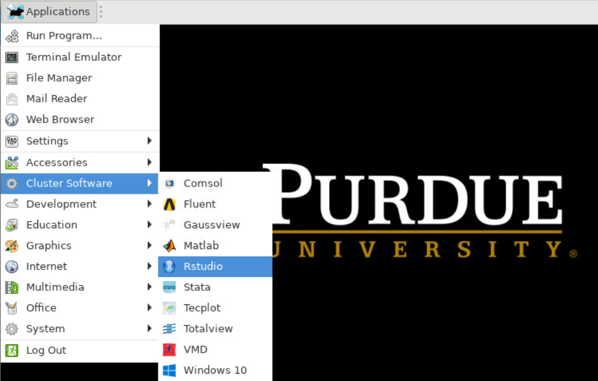

---
tags:
  - Gautschi
authors:
  - jin456
resource: Gautschi
search:
  boost: 2
---

RStudio is a graphical integrated development environment (IDE) for R. RStudio is the most popular environment for developing both R scripts and packages. RStudio is provided on most Research systems.

There are two methods to launch RStudio on the cluster: command-line and application menu icon.

## Launch RStudio via command-line:

```bash
module load gcc
module load r
module load rstudio
rstudio
```

Note that RStudio is a graphical program and in order to run it you must have a local X11 server running or use [Thinlinc PLACEHOLDER :octicons-link-external-16:](https://rcac.purdue.edu/knowledge/gautschi/accounts/login/thinlinc) Remote Desktop environment. See the [ssh X11 forwarding section PLACEHOLDER :octicons-link-external-16:](https://rcac.purdue.edu/knowledge/gautschi/accounts/login/x11) for more details.

## Launch Rstudio via the application menu icon:

- Log into desktop.gautschi.rcac.purdue.edu with web browser or [ThinLinc PLACEHOLDER :octicons-link-external-16:](https://rcac.purdue.edu/knowledge/gautschi/accounts/login/thinlinc) client
- Click on the ```Applications``` drop down menu on the top left corner
- Choose ```Cluster Software``` and then ```RStudio```



R and RStudio are free to download and run on your local machine. For more information about RStudio:

- [RStudio Official Website :octicons-link-external-16:](https://www.rstudio.com/)
- [RStudio Essentials: Tutorial :octicons-link-external-16:](https://www.rstudio.com/resources/webinars/#rstudioessentials)
- [DataCamp: Working with the RStudio IDE :octicons-link-external-16:](https://www.datacamp.com/courses/working-with-the-rstudio-ide-part-1)

[Return to the Guide](../r_example.md)
