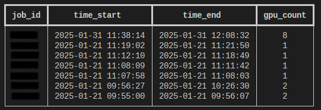
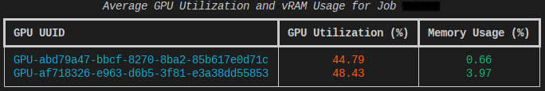
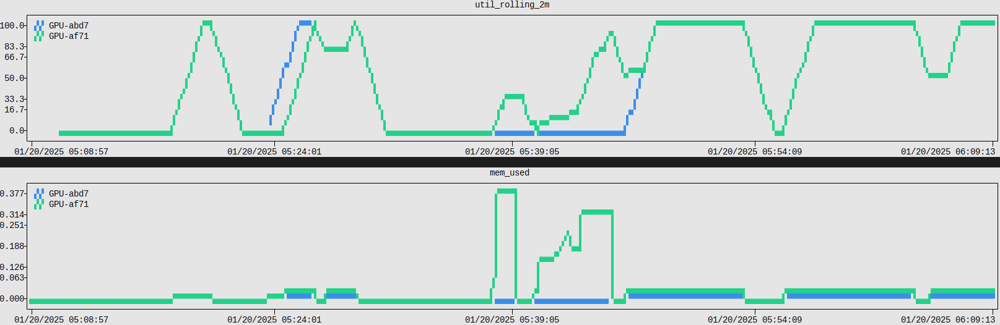

---
tags:
  - Gautschi
authors:
  - jin456
resource: Gautschi
search:
  boost: 2
---

## What is it?

To ensure that GPUs are effectively utilized on our cluster, we log and store the power, memory, and utilization of every GPU on our cluster every 10 seconds. RCAC uses this data to identify users that request large amounts of GPU hours but do not actually use them.

To assist users in optimizing their usage of requested GPU resources, we have created a GPU usage monitor tool that allows users to track their GPU utilization for jobs that they have submitted. The purpose of this tool is to provide users an interface to identify jobs or GPUs that they have requested but are not being effectively utilized.

## How to use

Our GPU Usage monitor is currently implemented on ```Gautschi``` and ```Gilbreth```, and is available at the following location:

```bash
/apps/external/gpu_util/get_gpu_util
```

## Seeing Logged Jobs

You can check all the jobs that you've run with the ```-u``` or ```--user_jobs``` flag:

```bash
/apps/external/gpu_util/get_gpu_util --user_jobs
```

This will print a table of all the GPU jobs you have submitted to the cluster, with the job ID, start and end times, and the number of GPUs that that job had allocated to it:


<figcaption>A table of GPU jobs submitted to the cluster.</figcaption>

It should be noted that we collect GPU usage information every 3 - 3.5 hours. If you have recently submitted a job, your job may not be available yet.

## Inspecting a specific job

If you want to view the GPU utilization of a specific job, you can use the ```-j``` or ```--job_id``` flag. For example, to see the utilization of job 1234, you may run the following:

```bash
/apps/external/gpu_util/get_gpu_util --job_id 1234
```

This will print a table of the GPU memory and utilization for each GPU that was allocated for the specified job:


<figcaption>A table of GPU and memory utilization.</figcaption>

## Plotting Data

It is also possible to plot the GPU utilization and memory usage over time with the ```-p``` or the ```--plot``` flag:

```bash
/apps/external/gpu_util/get_gpu_util --job_id 1234 --plot
```

This will print two graphs. The first will be a 2-minute rolling average of the GPU utilization over time, and the second will be the percentage of memory used over time. Each GPU will be colored differently:


<figcaption>A graph showing GPU utilization over time.</figcaption>

## Saving GPU Data

If you would like to save the raw GPU utilization and memory usage data for your job, you can use the ```-s``` or ```--save``` flag:

```bash
/apps/external/gpu_util/get_gpu_util --job_id 1234 --save
```

This will download the GPU data for a specific job as:

```bash
{job_id}_gpu_usage.csv
```

## Checking Account Usage (Group Managers Only)

If you are a manager of a specific group, you are able to query all accounts owned by that group. You can check the usage of all members of your account over the previous week by running:

```bash
/apps/external/gpu_util/get_gpu_util -A accountname
```

If you would like a breakdown of the individual jobs ran within the past week, you can add the ```--records``` flag:

```bash
/apps/external/gpu_util/get_gpu_util -A accountname --records
```

Further, the ```--job {jobid}``` flag will also allow you to query the utilization of individual jobs that were ran on an account that you manage.

## FAQ/Troubleshooting
- ### "Why doesn't my job show up in the list?"
 Although we log GPU utilization every 10 seconds, we only actually collect it every 3-3.5 hours. If you check later, your job should be listed.

- ### "Can other people see my data?"
 No, our interface only allows users to check the utilization of their own jobs.

- ### "Is this a good way to see the GPU Hours balance?"
 No, the primary purpose of this tool is to check that GPUs are actually being used, not to track billed GPU hours. To see the total GPU hours balance, please use the ```slist``` command.

 [**Back to the Running Jobs section**](../run_jobs/index.md)
 