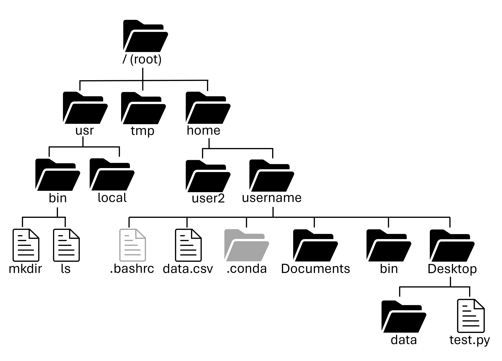
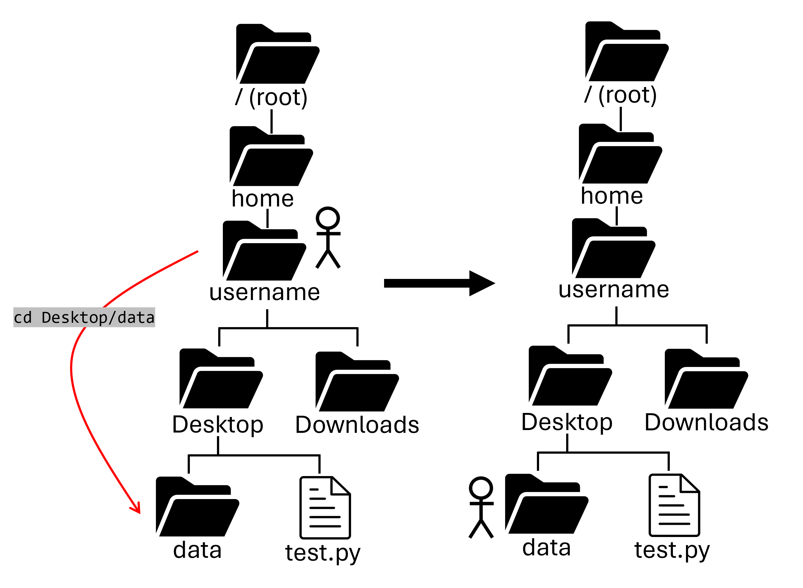
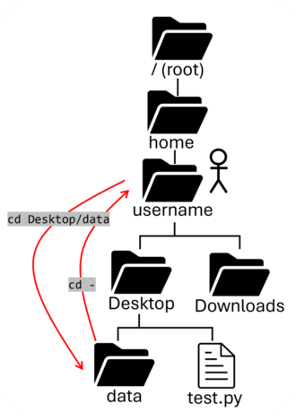
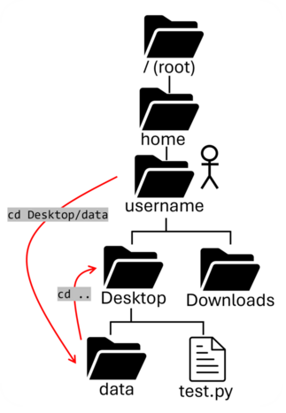

# Navigate the file system

[Back to Week 1](./index.md)

Now that we have learned about the shell and the anatomy of a command, let's dive into different helpful programs (that you can run as commands) that you typically encounter while working on UNIX systems.

As a user, you can picture a filesystem as a series of nested files and folders(a.k.a. directories). 



### pwd:

`pwd` is a program that is occasionally helpful, but is a good way to get your feet wet in trying out different UNIX commands. All it does is print out what directory (folder) you are currently in. Usually you will already know where you're at from the prompt, but it can be helpful to know the full path. `pwd` stands for *print working directory*:

```bash
$ pwd
/home/username
```

??? question "What directory are you in when you open your shell?"

    Most shells start in your home directory!

    ```bash
    $ pwd
    /home/username
    ```
    
### ls:

`ls` is one of the most common UNIX programs that you may use while on UNIX systems. By default, it lists the contents of your current working directory:

```bash
$ ls
data.csv		Documents       bin      Desktop
```

There are many options that `ls` can use to modify its
behavior. In addition, you can specify a directory as an
argument to list contents of that directory.

!!! note "File Extensions"
     In UNIX systems, file extensions are technically meaningless, however, convention is important. Executables don't need to end in `.exe` and text files don't need to end in `.txt`. It is helpful if they do, so that people (including yourself) know what type of file it is.
     

!!! note "Hidden Files"
    Files and directories that start with a "." are hidden by default. You can use the `-a` or `--all` options to see them!

!!! tip "Wildcards"
    Wildcards are special characters that let you match multiple files or directories at once, instead of typing each name manually. Bash expands wildcards before a command runs, so the program receives a list of matching filenames. These can be used to match a specific subset of files based on their name. The primary wildcards used are:

    * `*` matches any number of characters
    * `?` - matches exactly one character
    * `[abc]` or `[a-z]` - matches one character from a set or range

    You can substitute these in to match specific patterns like so:

    ```bash
    $ ls *.txt
    file1.txt file2.txt file3.txt
    ```

    ```bash
    $ ls data?.[ct]sv
    data1.csv data2.tsv data3.csv
    ```

??? question "What files and folders are hidden in your home directory?"

    Check with `$ ls --all`! These will vary depending on what you have installed, but most will be configuration files for programs you have installed. Common ones are:

    ```
    .bashrc     - bash startup customization file
    .conda      - Conda python environments
    .cache      - Cached data (like photo thumbnails)
    .ssh        - Configuration files for SSH
    ```

??? question "How would you list all of the png files in your Downloads folder?"
    
    Use `$ ls Downloads/*.png`!

### cd

Another one of the most common programs to run on UNIX systems
is `cd`, which stands for *change directory*, but should be
thought of as *change working directory*. This will change
which directory you are currently working in.

```
$ pwd
/home/username
$ cd Desktop/data
$ pwd
/home/username/Desktop/data
```



!!! tip "Autocomplete"
    Most terminal interfaces support using `tab` to autocomplete file and folders that exist in your working directory. This works for most commands, but is especially helpful with `cd`.

!!! tip "Returning Home"
    If you run the `cd` command without arguments, you will return back to your home directory.


??? question "How can we move to our Documents folder?"

    Use `$ cd Documents`!

    ??? question "How can we move back to your Home directory?"

        There's several ways!

        * Specify the whole path with `$ cd /home/username` 
        * You can always return home with just `cd`
        * You can also use `cd ..` to move *up* a directory, or `cd -` to move to your previous directory (more on this later!)

### mkdir

The last program we'll go over in this section is the `mkdir` or *make directory* command. This does what it sounds like and will create the directory noted in the argument if it doesn't already exist.

```
$ mkdir example-data
```
You can also put multiple arguments and `mkdir` will
create all of them. A helpful option to pass to the `mkdir`
program is `-p`, which will create parent directories as needed.
```
$ mkdir -p another_one/test1
```
Which will create the `another_one` directory in your current
directory and the `test1` directory within the `another_one`
directory.

??? question "How would you make a folder on your Desktop titled `myfolder`?"

    There are several ways! We could first `cd` to the Desktop, and run `mkdir`:

    ```bash 
    cd /home/user/Desktop
    mkdir myfolder
    ```

    Or we could make it from our home directory by specifying the path:

    ```bash
    mkdir Desktop/myfolder
    ```

## Paths

All files in UNIX systems are organized into directories, and
those directories may have subdirectories, creating a tree
of files that span the entire operating system. Directory paths
in UNIX systems can be *absolute* or *relative*. Absolute paths
start at the root of the file system and thus always start with
a slash (`/`). Relative paths are relative to your current working
directory and do not start with a slash.

### Absolute path
```
$ ls /home/username/Desktop
output_of_ls
```
### Relative path
```   
$ ls Desktop
output_of_ls
```


### Special paths

There four special paths that are commonly used in navigating
UNIX file systems:

#### Previous Working Directory: `-`

* The `-` represents the previous working directory (the directory you were in before your current one)
* You can run `cd -` to navigate to the previous directory you were in.

```bash
$ cd Desktop/data
$ cd -
$ pwd
/home/username
```



#### Home Directory: `~`

* The `~` represents your home directory. You can `cd ~` to move back to your home directory, or `cd ~/Desktop` to move to your desktop
* You can also just type `cd` (without any arguments) to return to your home directory

#### Current Working Directory: `.`

* The `.` represents the directory you are currently in. You can use it to reference certain files in your current directory (like `ls ./myfile.txt`)

#### Parent Working Directory: `..`

* The `..` represents the parent directory of the directory you are currently in. For example, if you are in `/home/username/Documents/mydata`, the command `cd ..` will change your directory to `/home/username/Documents`
* You can also stack these! For example, to move "up" two directories, you could use the command `cd ../../`

```bash
$ cd Desktop/data
$ cd ..
$ pwd
/home/username/Desktop
```



??? question "How would we move from the `data` directory to the Downloads directory with one command?"
     ```bash 
     cd ../../Downloads
     ```


## Permissions
Since everything in UNIX systems is a file, file permissions are
of supreme importance. To check the permissions of a file, run
the command `ls -l` which runs the `ls` program with the `l` option
which tells `ls` to print out more information about the files.

The following code block shows an example of what you might see from
the longer `ls` output:
```bash
$ ls -a -l -h ~/.ssh
total 6.0K
drwxr-xr-x  2 username student    4 Jul 17 11:19 .
drwx------ 14 username student   28 Jul 16 22:26 ..
-rw-r--r--  1 username student 2.0K Oct 18  2021 authorized_keys
-rw-r--r--  1 username student    0 Jul 17 11:19 config
```

The three program options used here are: `a`, which displays all files/folders,
even hidden ones; `l` which lists out more information about each listing;
and `h` which shows the size of items in a human-readable format. 

In the first ten columns of the output are the permissions of that item, details of which will be discussed in the next paragraph. The next number is the number of hardlinks to the file, which for most use cases isn't important. 

After that, we have the username of the <span class="perm-user">owner</span> of the file and then the name of the <span class="perm-group">group</span> that owns access to the file. The number after that is the size of the item. Then comes the date that the item was most recently modified. Last of all is the name of the actual item.


The four items in the `.ssh` folder of this home directory are: 

1) The current directory (`.`)

2) A link to the parent directory (`..`)

3) Two files:

* `authorized_keys`

* `config`

Let's talk permissions. The first ten characters of each row
represent the permissions for each item listed:

<span class="perm-type">-</span><span class="perm-user">rw-</span><span class="perm-group">r--</span><span class="perm-other">r--</span>  1 username groupname  4096 Jan  5  notes.txt

The first column shows whether it's a directory (with a `d`) or not (with a dash):

<span class="perm-type">d</span>rwxr-x--- 2 username groupname  4096 Jan  5  secure_dir


Then the next nine columns are broken into three groups of three:

1) First three - <span class="perm-user">User</span> (`u`)

 -<span class="perm-user">rw-</span>r----  1 username groupname  4096 Jan  5  notes.txt


2) Second three - <span class="perm-group">Group</span> (`g`)

-rw-<span class="perm-group">r--</span>r--  1 username groupname  4096 Jan  5  notes.txt

3) Last three - <span class="perm-other">Others</span> (`o`)

-rw-r--<span class="perm-other">r--</span>  1 username groupname  4096 Jan  5  notes.txt

Each group of three is made up of the read (`r`), write (`w`), and execute (`x`)
bits. The read bit controls whether someone can look at the
data contained in the file. The write bit controls whether someone
can edit the data in the file. And the execute bit controls if
someone can run that file as a program. We'll talk more about the
"execute" bit in the [Week 3 "Scripting" section](../week3/scripting.md). 

<!-- For directories, the permission bits mean slightly different things.
The write bit is the same, it controls whether someone can modify
(e.g. delete) is. The execute bit controls whether someone can see
what's inside the directory. The read bit controls whether
someone can go into that folder. -->

## Learning about command options

#### man

Another helpful program is `man`, which stands for *manual*. You may
hear the term *man page* which is just short for *manual page*, or
running the program `man` with the argument being the program you
want more information about.

```
$ man ls
```
The `man` program pulls up a page that you can scroll up and down
with your arrow keys or the `j`/`k` keys and quit out of by
pressing the `q` key. It is up to each program to provide its
own `man` page, so not all programs have them, but when they do
it can be helpful.

<!-- As a quiz, who can find (using the `ls` `man` page) what are the
options necessary to list items by reverse chronological order
(older items listed first).

.. admonition:: Answer
   :collapsible: closed

   The command would be `$ ls -t -r` -->

Next section: [Editing Files](./editing.md)