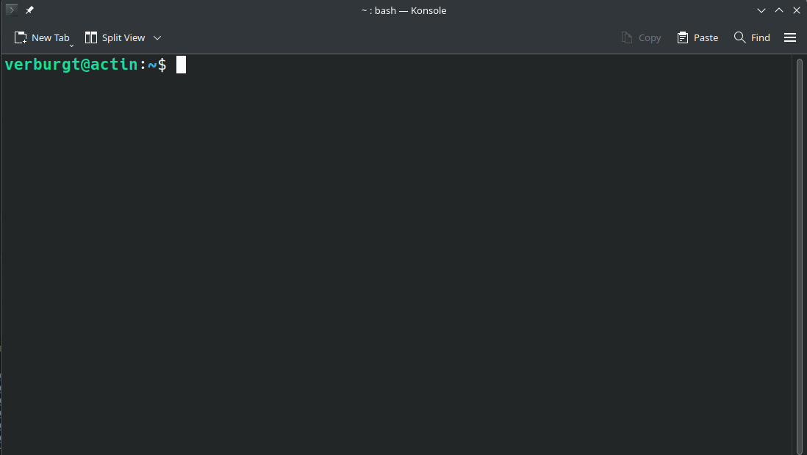
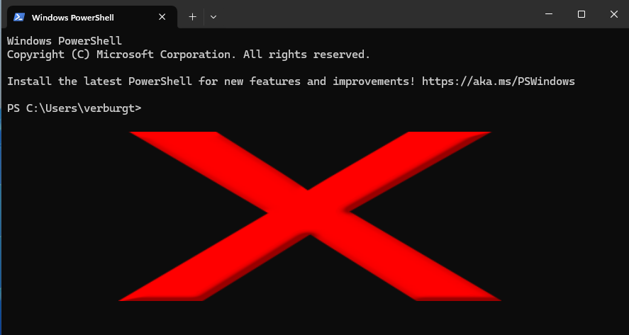
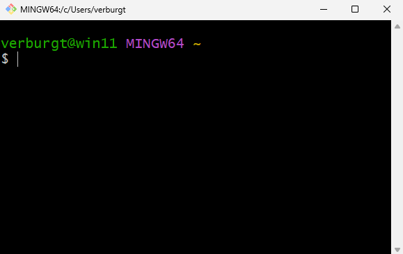

# Setting up for the workshop

[Back to Week 1](./index.md)

In this workshop we will be learning
about both UNIX systems and how to
use Purdue's HPC clusters. For the
UNIX portions, you can either use
your own computer, or if you have
been granted access to a cluster,
you can use that cluster as your
UNIX system. In the next section,
we will discuss how to get onto
the clusters if you have already
been granted access through your
research group.

For those of you who do not have
cluster access currently, we can
use your local computer as a UNIX
system, but you won't be able to
try all the Slurm cluster commands
that we will go over in weeks 2 and
4.

For Mac and Linux users, your computer
is already a UNIX system, so there's no
need to download anything extra to make
sure we can run the UNIX commands.

## Linux

Linux users can open up Gnome
Terminal or KDE Konsole or xterm,
which can be found via the applications
menu or the search bar.
Linux computers, by default, use
Bash as their shell, but if you've
changed the default, you can open
a terminal and type `bash`, then
hit enter to make sure you're using
the correct shell.



## Mac

Mac users can run the **Terminal**
program to open up a shell. By default, the shell is likely `zsh`. Then type
`bash` and hit enter to make sure you
are using the correct shell.


## Windows

Windows computers are not UNIX-based, and the default command prompt or Powershell will **NOT** work!


We will need to install extra software on Windows to
ensure that we can run the UNIX
commands on your computer:


* The easiest option for a UNIX-like terminal on Windows is called
[Git for Windows](https://gitforwindows.org) and will allow
you to use a UNIX shell called Bash
(which we will talk about later).
    * Instructions on how to download and
install [Git for Windows](https://gitforwindows.org) can be
found here: 
[Installation instructions](https://carpentries.github.io/workshop-template/install_instructions/#shell).
Just make sure to click to the tabs that
say **Windows** and **Git for Windows**.
    * Once Git for Windows is installed,
you can open a terminal by running
the program Git Bash from the Windows
start menu.
    
* Microsoft has also Developed the "Windows Subsystem for Linux" (WSL) which allows you to run Ubuntu Linux within Windows. 
    * Installation Instructions can be found [here](https://learn.microsoft.com/en-us/windows/wsl/install).
        ```powershell
        wsl --install ubuntu
        ``` 

   Next section: [Access](./access.md)