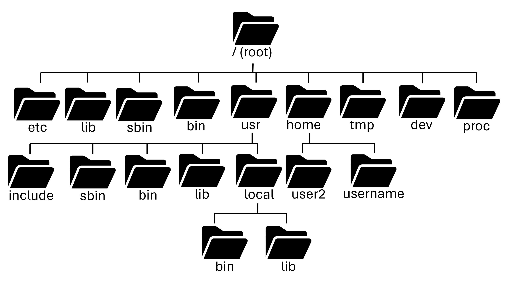

# What is Unix?

[Back to Week 1](./index.md)

## The Unix Operating System

Unix is a broad family of multitasking, multi-user operating systems,
stemming from the original AT&T Unix, developed by Bell Labs in the
early 1970s. It is often associated with its rich tradition with
command-line environments, the UNIX "shell", and the C-programming
language.

Unix can also refer to a trademark, where other operating systems must
conform to a certain set of standards to be considered a "UNIX"
operating system.

Unix has many different variants:

* Genetic UNIX (such as FreeBSD)
* Branded UNIX (such as macOS)
* Functional UNIX (such as Linux)

Genetic UNIX means that the operating system can directly trace
its lineage back to the original Unix operating systems from the
70s. Branded UNIX is an operating system that has paid to have
the trademark of UNIX bestowed upon it, and has to fit a set of
standards to be considered such. Lastly, functional UNIX refers
to operating systems that follow the same standards as UNIX and
look/feel like UNIX, but do not pay to have the same trademark.

## Why Unix?

There are many reasons why one would want to use a UNIX operating
system for servers (both in HPC and Cloud scenarios).

* Performance

    UNIX systems are often relatively lightweight and avoid much of the overhead found in more consumer-oriented operating systems, making them well suited for compute-intensive workloads.
 
* Compatibility
    
    Many scientific applications, libraries, and tools are built for UNIX-like environments, allowing a wide range of workflows to run with minimal friction.

* Configurability
    
    UNIX systems are highly flexible and provide fine-grained control over system behavior, software environments, permissions, and automation, making them adaptable to many different use cases.

* Multi-user

    UNIX systems are designed to support multiple users simultaneously, each with their own processes, files, and permissions, which is an essential feature for shared systems like HPC clusters. Imagine if HPC clusters were limited to one user at a time! Science would grind to a halt very quickly.

* Cost

    UNIX systems, particularly Linux distributions, are free or low-cost. This is particularly important at scale in enterprise and research environments where we have thousands of users.

* Programming environment
    
    As apposed to operating systems like Windows, UNIX systems offer a strong, text-based workflow that is ideal for remote access, scripting, and automation. We'll cover more of scripting and automation in [Week 3](../week3/index.md).

## Unix components

UNIX systems are typically made up of three main components
that we will discuss in the following text. The three
components are:

* The File system hierarchy standard
* The Executable and library format
* The shell

### File system hierarchy

In UNIX systems, there is a conventional layout of the file system directories. There are **standard structures, names and purposes for different directories.**
Some names exist only at the root of the file system and others are repeated in layers for a similar purpose or function. Some common directories you may see are:

* **/bin** - where system binaries and executables go
* **/usr** - user binaries and libraries
* **/lib** - includes system libraries necessary for the binaries
* **/etc** - often contains system configuration files

There's lots of other top-level directories that you might come across like `/boot`, `/sys`, `/mnt`, `/tmp`, and others. Luckily, as a user you rarely will have to deal with these. Almost all of your day to day work is done in `/home`.

### Everything is a file

A core UNIX design principle is that **everything is treated as a file**.

This means:

* Programs are just files (or collections of files)
* System configurations are stored in plain text files  
* Devices (such as keyboards, disks, and GPUs) appear as files  
* Process and kernel information are exposed through virtual files  
* Inter-process communication often uses file-like interfaces  

---

### Metadata & Permissions

Every file has **metadata** that describes:

* **Ownership** - which user owns the file  
* **Group** - which group owns the file  
* **Permissions** - who can read, write, or execute it  
* **Timestamps** - when the file was created, modified, and accessed  

These properties form the basis of UNIX security and access control.

---

### Executables and libraries

Programs in UNIX are just files.

* **Executables** are files that can be run as programs.  
* **Libraries** are shared code files that executables depend on at runtime.

The operating system uses file metadata and standardized binary formats to determine **how programs are loaded, linked, and executed**.

---

### The Shell

The **shell** is the primary interface for interacting with a UNIX system.

It provides:

* A command-line environment  
* Program execution  
* File management  
* Scripting and automation  

The shell acts as the bridge between the user and the operating system, enabling both interactive work and powerful automation. We will explore the shell in much more detail in the next section.

Next section: [The Shell](./shell.md)