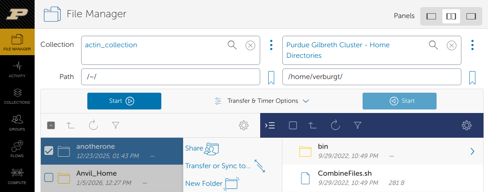

# File storage and transfer

[Back to Week 2](./index.md)

Now that we can get onto the cluster, we
want to get our data and files onto it as
well.

There are four main areas that you may want to
store data/files on:

* Home
* Scratch
* Depot
* Fortress

We will discuss in more detail what each of these areas are
in the [week 4](../week4/index.md) section.

For now, we will put everything into our home directories,
as that is where we land whenever we log into the
clusters.

There are several ways to get data and files onto and off of
the clusters:

1) Open OnDemand

2) Globus

3) scp

4) rsync

5) sftp

<!-- 6) SMB -->


### GUI Methods

=== "Open OnDemand"

    In the files tab of the Open on Demand page, there are
    upload and download buttons, but they are limited in
    what they can do. e.g. there is a file size limit of
    100 GB to upload and if your connection is flaky at
    all, you're going to have a bad time.

    

=== "Globus"

    For transferring large data to the cluster, you will
    want to use the [Globus transfer service](https://transfer.rcac.purdue.edu). If you want to transfer files from your local machine
    to the cluster, you will need to install the [Globus Connect
    Personal](https://www.globus.org/globus-connect-personal) software on your local computer.

    From the Globus transfer service, you can select a source
    and a destination. It will handle the actual transferring
    of the file(s) for you, resuming if there's network
    connectivity problems.

    

---

### Command Based Methods

=== "scp"

    `scp` stands for `secure copy protocol` and is the server version of the `cp` we saw last week. It needs a source and a destination, but one of them may be a server.

    Copying to a cluster:
    ```bash
    $ scp ./source_file USERNAME@CLUSTER.rcac.purdue.edu:~/some_dir/cluster_file_name
    ```
    Copying from a cluster:
    ```bash 
    $ scp USERNAME@CLUSTER.rcac.purdue.edu:~/some_dir/cluster_file_name ./destination_file
    ```
    When copying from a cluster, the destination file will go into the directory you are currently in. You can also specify a path you want the destination file to go to. This path can be either relative, or absolute.

=== "rsync"

    `rsync` is similar to `scp`, but much more fully-featured. It is especially useful for transferring directories, syncing changed files, and resuming interrupted transfers.

    Copying a file to a cluster:
    ```bash
    $ rsync ./source_file USERNAME@CLUSTER.rcac.purdue.edu:~/some_dir/cluster_file_name
    ```

    Copying a file from a cluster:
    ```bash
    $ rsync USERNAME@CLUSTER.rcac.purdue.edu:~/some_dir/cluster_file_name ./destination_file
    ```

    Copying a directory to a cluster:
    ```bash
    $ rsync -av ./my_directory/ USERNAME@CLUSTER.rcac.purdue.edu:~/some_dir/
    ```

    Copying a directory from a cluster:
    ```bash
    $ rsync -av USERNAME@CLUSTER.rcac.purdue.edu:~/some_dir/my_directory/ ./my_directory/
    ```

    A few common options are:

    - `-a` for **archive mode**, which preserves file structure, permissions, and timestamps
    - `-v` for **verbose**, which shows what is being transferred
    - `-h` for **human-readable** file sizes
    - `--progress` to show transfer progress
    - `--partial` to keep partially transferred files if a transfer is interrupted

=== "sftp"

    `sftp` stands for `secure file transfer protocol` is a
    reliable way to transfer files between the cluster and
    another computer.

    Essentially, `sftp` starts a file transfer shell on a
    remote computer. Simple use the command `sftp USERNAME@CLUSTER.rcac.purdue.edu`
    to start the file transfer session. After logging in,
    use the `get` and `put` programs to transfer to and from
    the cluster you are connected to:

    ```bash
    $ sftp USERNAME@CLUSTER.rcac.purdue.edu

        (transfer TO CLUSTER)
    sftp> put sourcefile somedir/destinationfile
    sftp> put -P sourcefile somedir/

        (transfer FROM CLUSTER)
    sftp> get sourcefile somedir/destinationfile
    sftp> get -P sourcefile somedir/

    sftp> exit
    ```
    When transferring to and from the cluster via `sftp`, the transferring on the side of your local computer will be relative to the directory you were in when you initiated the `sftp` session.

---

<!-- ### SMB

`SMB`, also known as `Samba` is a way to connect a
remote drive to your computer to transfer files
back and forth to the clusters in a graphical way.

To learn more about this option, please visit this
site: [SMB drives](https://www.rcac.purdue.edu/knowledge/negishi/storage/transfer/cifs) -->


## Helpful RCAC programs for file management 

The following two programs can be helpful for you as you
navigate using the clusters. As a note, these are RCAC
specific programs, meaning that we implemented these and
other supercomputers may not have them.

### myquota

`myquota` is run without any arguments and tells you
where you have access to read and write files. It also
tells you what the space quotas are for each of those
spaces and how much you have used already. We'll talk more about filesystems in [Week 4](../week4/storage-transfer.md#file-storage-and-transfers)

```bash
$ myquota
Type     Location   Size    Limit    Use   Files   Limit    Use
===============================================================
home     username  809KB   25.0GB  0.00%       -       -      -
scratch  cluster    36KB  200.0TB  0.00%      0k  2,000k  0.00%
depot    group    92.0MB    1.0TB     1%       -       -      -
```

### flost

RCAC regularly backs up data in home and depot spaces, so that if something is accidentally deleted or overwritten, it can be recovered (if it's been there sufficiently long). We have daily, weekly, and monthly snapshots for varying amounts of time. If you lost something in your scratch space, we don't have backups of those, so you're out of luck.

```
$ flost
This script will help you try to recover lost home or group directory contents.
NB: Scratch directories are not backed up and cannot be recovered.

Currently anchoring the search under: $HOME
If your lost files were on a different filesystem, exit now with Ctrl-C and
rerun flost with a suitable '-w WHERE' argument (or see 'flost -h' for help).

Please enter the date that you lost your files: 2024-10-01
```
<!-- 
Next Section: [Cluster Applications](./applications.md) -->

Continue to [Week 3](../week3/index.md)