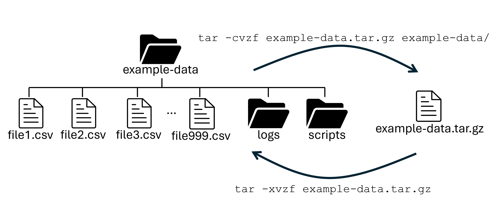
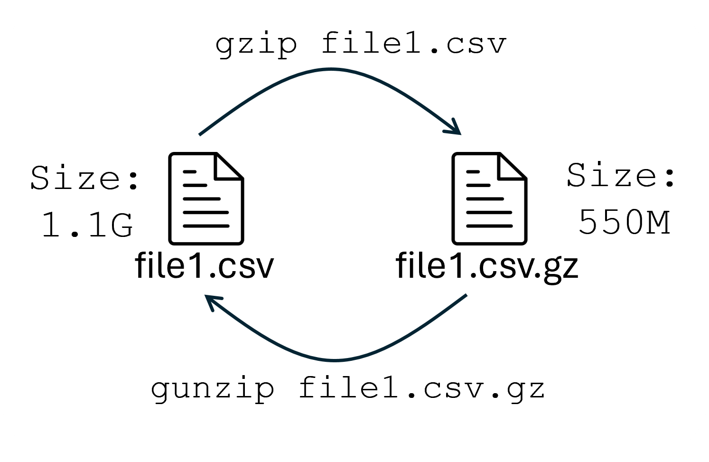

# Managing files and directories

[Back to Week 3](./index.md)

Now that we can create files from the
output of processes, we should learn
some file management techniques. In
this section, we will go over three
main topics surrounding file
management:

1) Archive formats for managing files and data

2) Data compression programs

3) Finding files


## Archiving 

To archive a file or directory means to
bundle those files up into a single archive
file.

The `zip` and `tar` programs can create
archive files of whole directories.
They differ in that `tar` compresses the
whole output together instead of
individually compressing files within the
archive.

### TAR (Tape ARchive)

`tar` stands for "Tape ARchive" format,
because tape archives do better with one
big file instead of many, smaller files. We will learn more on how to archive data at RCAC in [Week 4](../week4/index.md). 




To package a directory into a single, compressed file, you would use the following command:

```bash
$ tar -cvzf example-data.tar.gz example-data/
```
In the example above, we supplied four options
to the `tar` program and two arguments. The
options are:

* `c` - create 
* `v` - verbose
* `z` - gzip (compress)
* `f` - file named the following. 

The first argument (`example-data.tar.gz`) is actually an extension of the `f` option, which tells `tar` what we want to name the archive. The second (and following) argument(s) tells `tar` what we want to archive.

To undo the archiving, simply swap the `c`
option for the `x` option (which stands for
extract):

```bash
$ tar -xvzf example-data.tar.gz
```

### Zip

The `zip` program is simpler to use, but
often people prefer `tar` over `zip`.

```bash
$ zip -r archive-name.zip example-data/
$ unzip archive-name.zip
```

!!! note "File name conventions"
     As mentioned in earlier sections, file name extensions are usually meaningless in UNIX systems. However it is common to use `.tar.gz` to denote gzip-compressed tar archive files and `.zip` to denote archive files made with the `zip` program.

## Compression

Compressing a file is to take it and make
it smaller, but unreadable (by humans).
There are three main programs used to
compress individual files and streams
and they all have nearly identical
usage and behavior. The three are:

* `gzip` (fast, very common)
* `bzip2` (usually compresses smaller than gzip, but slower)
* `xz` (often the smallest files, but slowest / most CPU-heavy)





#### `gzip` (`.gz`)

```bash
$ gzip *.txt
$ cat *.gz | gunzip
```

#### `bzip2` (`.bz2`)

```bash
bzip2 file.txt
bunzip2 file.txt.bz2
```

#### `xz` (`.xz`)

```bash
xz file.txt
unxz file.txt.xz
```

Compressed data from these programs can be
stacked safely and decompressed in
concatenated form.

## Finding Files

When you have a lot of files, it can be useful
to have a program to find files that match a
pattern. To do this, use the `find` program.

```bash
$ find ~ -type f -name "*.txt" | grep "example-data"
~/example-data/paper.txt
```

The first argument to `find` that we provided was the folder we
want to search in, in this case our home (`~`) directory. 

The `-type` option narrows down
what kind of listing the command will find.
Putting `f` here narrows the search to just
find regular files.

 The `-name` option filters the search to only list the files
and such that follow the pattern given, in
this case, everything that ends in `.txt` (Remember that `*` is a wildcard that matches any number of any characters!).

This command would find *all* the `.txt` that we have in our home directory. To further filter down the file(s) we are looking for, we can pipe (`|`) the contents into a pattern matching program called `grep`. `grep` (without any options) will filter the `stdin` to keep only lines that match the provided pattern(`example-data"`)


### Useful Programs

| Program | Action |
|---|---|
| `zip/unzip` | Create/extract/update archive of files |
| `tar` | Create/extract "tape" archive of files |
| `gzip/gunzip` | Gzip (zlib) compression (most common) |
| `bzip2/bunzip2` | Bzip compression |
| `xz/unxz` | XZ (LZMA) compression |
| `find` | Search for files |


Continue to [Week 4](../week4/index.md)