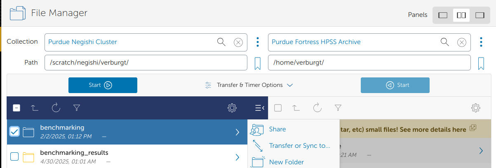

# File storage and transfers

[Back to Week 4](./index.md)

There are many places you can store your files to access them on the clusters:

* Local (mountable)
    * `/home`
    * `/depot`
    * `/scratch`
    * `/tmp`

* Indirect access
    * `Fortress` (HPSS tape archive)
    * `Ceph` (S3 object storage)

* Cloud
    * Box.com / REED
    * GitHub (github.itap.purdue.edu)

* Libraries
    * PURR - research data repository providing data management, DOI, citation tracking

Of these, only the **Local** and **Indirect access** options are directly available/mounted onto the clusters. The **Cloud** and **Libraries** are good places to store your files, but require more steps to get onto the clusters.

## Local Storage


### Home directory: `$HOME`
#### Path: `/home/username`

Your home directory is small (only 25GB), it has mild performance and is cluster specific (it is shared between nodes of a cluster, but not across clusters). It is also mountable on your local computer as a network drive.

Home directories are housed on redundant hardware, are **never purged** and are protected by snapshots. They are private to each user (they cannot be accessed by other members of your research group)

Home directories are good for personal configuration files, software installation, scripts, etc. You can also store personal data and job files, if they're small enough. It's ok to run jobs against your home directory, but it's not good for heavy I/O scenarios. In short, it's good for medium to long term storage.

### Depot directory
#### Path: `/depot/<group_name>`

The Data Depot is a group directory mounted on all Purdue community clusters. It is larger than your home directory (100GB free trial) and PI's can purchase additional space at $47/TB/year. It has reasonable performance with redundant hardware that is **never purged** and is protected by snapshots.

It is **mounted on all clusters**, so you see the same data no matter which cluster you're using. You can also mount it as a network drive on your local computer.

It is **owned by the PI** of the group and is **shared by group members**. It also offers fine-grained access controls.

Importantly, you can use the data depot without any cluster purchase, if you need somewhere persistent to store your data.

The Data Depot is good for shared configuration files, software installation, scripts, etc. You can store critical research data here to be shared amongst your group. It's ok to run jobs against but it's **not good for intensive I/O scenarios**. It is good for medium to long term storage.

### Scratch directory: `$CLUSTER_SCRATCH`, `$SCRATCH`, or `$RCAC_SCRATCH`

#### Path: `/scratch/<cluster>/username`

Your scratch directory is a high-performance directory on each cluster. It is huge (100+TB), however it does have a file number limit (in the millions), so make sure to not have a bunch of tiny files, use the `tar` and `zip` programs to bundle files together. It is highly performant, but cluster specific, in that it is shared across nodes in a cluster, but not across clusters. It is also mountable as a network drive on your local computer.
It is also private per user, other members of your group cannot access it.

The scratch system is internally redundant, so you don't have to worry about hardware failure corrupting your data, but there are no snapshots, so files are not recoverable if deleted. **It is also regularly purged of older files.**

Scratch directories are good for intermediate to massive data I/O, so are perfect for data intensive jobs. It is **NOT** for the primary copy of your data or software. And it is **NOT for long-term storage.** It is only for short-term storage of intermediate results.


!!! warning
     Beware of regular purging of older files. You can use the `purgelist` program to  tell you which files will be purged. Please do not try to game the system, as we will ban users who repeatedly do so. Just back older files up to Fortress instead of storing them on Scratch.

### Temporary directory
#### Path: `/tmp`

There is a node-local `/tmp` directory on Purdue's community clusters. It is moderately large (200+GB) with good performance. However, there is zero redundancy and files are purged after your job on the node ends. There are no snapshots of data in the `/tmp` directory.

It is node-local, i.e. each node of the cluster has its own `/tmp` that is world-readable (and sort of writable). It is what researchers used to use before the Scratch directory.

It is good for node-local caching of data and files. It is **NOT** for valuable data or software and **NOT** for long-term storage. It is rarely needed, but priceless when you do need it. Unless you understand the tradeoffs, consider just using your Scratch directory.


### Checking Access

Reminder that you can use the `myquota` command to check your current usage on local storage locations!
```bash
$ myquota
Type       Location             Size    Limit    Use   Files   Limit    Use
===========================================================================
home       username           18.0GB   25.0GB  72.0%      -       -      - 
scratch    username          670.8MB  200.0TB   0.0%  170.4K    2.0M   8.5%
depot      labname             4.0MB  100.0GB   0.0%      -       -      - 
```

|Storage | Location | Purpose | Availability| Capacity | Backed up?|
|--------|----------|-------|------------| ----| --- | 
| Home   | `/home/username`| Backed up personal storage | Shared across all nodes| 25 GB | Yes
| Scratch | `/scratch/cluster/username`| Large temporary files -  **Purged Regularly** | Shared across all nodes| 200 TB, 2M Files | No
| Depot | `/depot/labname`| Files and programs for your lab | Shared across all nodes **AND** across clusters| 100+ GB | Yes
| temp | `/tmp`| temporary files | Node specific| 200+ GB | No


## Indirect Access

### Fortress (HPSS tape archive)

#### Path:`/home/username`, `/group/<group-name>`

Fortress is our IBM HPSS system for long-term storage. It is huge (25PB) and is free up to a point. It's a tape system with a robotic arm. Its disk cache makes *writes* fast, but *reads* slow.

It is replicated, redundant, and never purged. It is accessible from all clusters with specialized command-line tools, as well as mountable as a network drive for external machines. All Data Depot groups get a `/group` Fortress directory.

Fortress is good for backing up (archiving) critical research data. It is good at storing large files **NOT for many small files**. It is **NOT** for running jobs against. It is made as a slow, long-term storage for your critical data.


To access Fortress and move files to/from it,
use the `hsi/htar` programs.

```bash
$ hsi
***************************************************************************
**  No Fortress keytab found in your home directory.  Creating one now.  **
***************************************************************************

...
[Fortress HSI]/home/username->
```

!!! note
     The HSI interface is not a true shell and only allows limited commands. It also doesn't allow for tab-completion.

We can use `hsi` to navigate the tape archive system. We can create, remove, rename, and directories "like normal". While in the `hsi` interface, use the `help` program for a listing of commands and what they do. Outside of the `hsi` interface, you can run `hsi help` to get the same information.

```bash
[Fortress HSI]/home/username->ls

[Fortress HSI]/home/username->mkdir example
mkdir: /home/username/example

[Fortress HSI]/home/username->cd example
[Fortress HSI]/home/username/example->ls -lh
```

Use `put` and `get` to copy data to and from the tape archive. Let's add our directory to the archive and try to get it back.

```bash
[Fortress HSI]/home/username->put -R example-data
put 'example-data/paper.txt' : paper.txt
```

!!! note
     Without specifying otherwise, we are operating with respect to our home directories (on both archive and cluster).

To exit the `hsi` interface, use the `exit` command.

```bash
[Fortress HSI]/home/username-> exit
username@loginXX.CLUSTER:[~] $
```

You can also use `hsi` commands in one shot without logging in first. Try removing the `example-data` directory from the cluster and then bringing it back with `hsi get`. To be extra safe, we will rename it here instead of actually deleting the directory and its contents.

```bash
$ mv example-data backup

$ hsi get -R example-data
Username: username UID: 143856 Acct: 143856(143856) Copies: 1 COS: 0 Firewall:
get '/home/username/example-data/paper.txt' :
'/home/username/example-data/paper.txt' ...
```

!!! warning
     Be sure you already have the data on Fortress before deleting it from your home directory!

Instead of using `hsi` command to get and put files, we shouldn't store all these smaller files separately. The tape archive is most efficient with large archive formats and has special capabilities with the `.tar` format.

### Transferring data to and from Fortress
You can bundle and send the whole directory in one stream with the `htar` program.:

```bash
$ htar -cvf example-data.tar example-data/
HTAR: a  example-data/
HTAR: a  example-data/paper.txt
...
```

In the example above, the options to the `htar` program are similar to the `tar` program. Except, we don't need to compress it using `gzip` (with the `z` flag).


### Example

Lets return to our Python job that we created in week 2, and make a few changes to it so our results get archived automatically. In our job script, we can use certain Slurm options to specify a path for the console output files in our job. These options are `-o/--output` (for `stdout`) and `-e/--error` (for `stderr`). 

So, our example job submission script might look like this:


```bash title="myjob.sh" linenums="1" hl_lines="8 15-16 19 22 24"
#!/bin/bash
#SBATCH  --account=hpcexc
#SBATCH  --partition=cpu
#SBATCH  --qos=normal
#SBATCH  --time=0-1:00:00
#SBATCH  --nodes=1
#SBATCH  --ntasks-per-node=1
#SBATCH  --output="example.out"

module load conda
conda activate example
echo "Running with the python interpreter: $(which python)"

#Lets move to our scratch directory to do computational work
mkdir -p ${SCRATCH}/example
cd ${SCRATCH}/example

#Lets run our python file from our Home directory, and write the output
python ~/example.py > results.out # Write the output into our current directory
echo "Python script done at $(date)!"
#Move up a directory (from /scratch/username/)
cd .. 

htar -cvf example.tar example/
echo "Backed up data to Fortress at $(date)!"

```

Once this runs we can check to see the status of the job with `squeue --me`. Once it finishes running, we can check the output file (`example.out`) to make sure it does what we expect. Remember that All the text that would normally print to the terminal (`stdout` and `stderr`) will instead go into the slurm log!

```bash
$ sbatch myjob.sh
Submitted batch job 2095574

$ cat ~/example.out
Running with the python interpreter: /home/username/.conda/envs/example/bin/python
Python script done at Wed Jan 28 12:45:49 EST 2026!
HTAR: a   example/
HTAR: a   example/results.out
HTAR: a   /tmp/HTAR_CF_CHK_1726143_1769622349
HTAR Create complete for example.tar. 3072 bytes written for 1 member files, max threads: 2 Transfer time: 0.032 seconds (0.097 MB/s) wallclock/user/sys: 0.281 0.012 0.007 seconds
HTAR: HTAR SUCCESSFUL
Backed up data to Fortress at Wed Jan 28 12:45:49 EST 2026!

```
<!-- 
??? question "If we run the job a second time, will it overwrite the output file? If so, what other options exist?"
     It will overwrite it. You can add substitution patterns like `%j` or `%A` so that different jobs write to different output files. See the *file pattern* section of the *manual page* for details. -->


Notice that this script doesn't contain our python output, because we redirected that output to a file (`> results.out`) and then archived the file with `htar`. There's two places we need to check for the output of our job. First is the `scratch` directory that the python output file was created in:

```bash
$ cat $SCRATCH/example/results.out
2499.9118
```

Then, we also need to check that our `example.tar` file was created on Fortress:

```bash
$ hsi ls
/home/username:
example-data/   example-data.tar   example.tar
```


### Transferring to Fortress via Globus

For a more interactive way to transfer data to Fortress, you can use our Globus transfer service at [https://transfer.rcac.purdue.edu](https://transfer.rcac.purdue.edu). Just be sure to archive large amounts of files (with `zip` or `tar`) before transferring!




**Next section:** [Job History](job-history.md)
