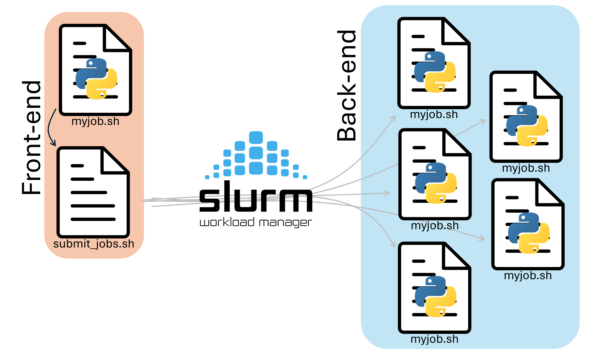
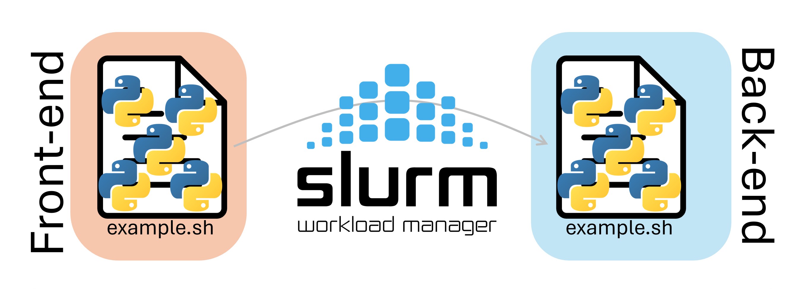

# Managing Workloads and Multiple Jobs

[Back to Week 4](./index.md)


Managing workloads and jobs is a crucial aspect of high-performance computing. In this section, we will discuss how to manage many-task workflows.

## Introduction
In many cases, researchers need to run the same task multiple times with different inputs. There are two main paradigms for managing such workloads:

1. **Submit lots of separate jobs**: This approach involves submitting each task as a separate job.

2. **Submit one job with many tasks inside**: This approach involves submitting a single job that runs multiple tasks.

## Lots of separate jobs

If we want to submit many separate jobs, we could simply run `sbatch` on many different job scripts:

```bash
sbatch job1.sh
sbatch job2.sh
sbatch job3.sh
...
```

Alternatively, if our job script is able to take arguments as input, we could reuse the same job submission script, and just change the input:

```bash

sbatch job.sh input_1
sbatch job.sh input_2
sbatch job.sh input_3
...
```

In either case, manually typing out `sbatch` for each of our jobs is tedious, and prone to user error. We can instead make a script that runs on the front-end to handle job submission for us. 

To do this, we need two files:

* A submitter script (`submit.sh`) that submits the jobs.
* A worker script (`myjob.sh`) that runs the tasks.





### Submitter Script
A submitter script runs on the frontend and submits multiple jobs to Slurm for us. A Submission script that submits 30 jobs with 30 different names would look like this:

```bash title="submit.sh" linenums="1" hl_lines="5"
#!/bin/bash

for step in {01..30}
do
  sbatch --job-name=example-${step} myjob.sh 
  sleep 0.01
done
```

Notice that we give each of our jobs a different name with the `--job-name` option!

### Worker Script
The worker script should look like this:
```bash title="myjob.sh" linenums="1" hl_lines="7 14-15"
#!/bin/bash
#SBATCH  --account=hpcexc
#SBATCH  --partition=cpu
#SBATCH  --qos=normal
#SBATCH  --time=0-1:00:00
#SBATCH  --nodes=1
#SBATCH  --cpus-per-task=1

module load conda
conda activate example
echo "Running with the python interpreter: $(which python)"

#Lets move to our scratch directory to do computational work
mkdir -p ${SCRATCH}/${SLURM_JOB_NAME}
cd ${SCRATCH}/${SLURM_JOB_NAME}

python ~/example.py > results.out # Write the output into our current directory
echo "Python script done at $(date)!"
```

Notice that we create and work in a different directory in our scratch based on the current job name. The first job that gets submitted would get a job name `example-01`, and would make the directory `/scratch/user/example-01`, the second job would make `/scratch/user/example-02`, and so on.


We don't have to submit this one, but to submit it, we would run the `submit.sh` file as a program:

```bash
$ bash ./submit.sh
Submitted batch job 209526
Submitted batch job 209527
Submitted batch job 209528
...
```

This will create 30 different scratch folders named `example-01` to `example-30`, and run a different instance of python in each directory.


!!! note "Slurm Environment Variables"
     You've probably seen us use `slurm` variables within some of the job scripts. `slurm` sets these variables when it starts our job in the compute node, and can be useful for gathering information about the running job. In the example above, we made directories based on the job name, which we accessed with the `${SLURM_JOB_NAME}` variable. Below is an incomplete list of `slurm` variables that we can use, some of which we will use later. 

     | Variable | Description |
     |----------|-------------|
     | `SLURM_SUBMIT_DIR` | Directory job was submitted from |
     | `SLURM_SUBMIT_HOST` | Host where `sbatch` was run |
     | `SLURM_JOB_ID` | Unique ID of the current job allocation |
     | `SLURM_JOB_NAME` | Job name specified by `--job-name` |
     | `SLURM_JOB_NODELIST` | Nodes assigned to the job |
     | `SLURM_JOB_NUM_NODES` | Number of nodes allocated |
     | `SLURM_NTASKS_PER_NODE` | Tasks per node |
     | `SLURM_CPUS_PER_TASK` | CPUs allocated per task |
     | `SLURM_PROCID` | MPI rank / global task ID |
     | `SLURM_LOCALID` | Task’s local rank on its node |
     | `SLURM_NODEID` | Node index within allocation |
     | `SLURM_ARRAY_TASK_ID` | ID of a task in a slurm job array |


### Slurm Job Arrays

Another way to manage many-task workflows is to use Slurm job arrays. This way, we can submit a single job instead of manually submitting many copies. The job is duplicated and runs `N` times with only `SLURM_ARRAY_TASK_ID` environment variable different.

Following is an example script that uses Slurm job arrays. Copy it into a file named `array.sh`
```bash title="array.sh" linenums="1" hl_lines="8 14-16"
#!/bin/bash
#SBATCH  --account=hpcexc
#SBATCH  --partition=cpu
#SBATCH  --qos=normal
#SBATCH  --time=0-1:00:00
#SBATCH  --nodes=1
#SBATCH  --cpus-per-task=1
#SBATCH  --array=1-30

module load conda
conda activate example
echo "Running with the python interpreter: $(which python)"

site=array-example-${SLURM_ARRAY_TASK_ID}
mkdir -p ${SCRATCH}/${site}
cd ${SCRATCH}/${site}

python ~/example.py > results.out # Write the output into our current directory
echo "Python script done at $(date)!"
```


Running `sbatch array.sh` will submit an array of 30 jobs to do the same task many times and save the output in different directories (`array-example-01` - `array-example-30`).

These examples are only the beginning, the mechanics of a job array can get a lot more sophisticated from here.

However, there are limitations on what you can do by submitting many jobs at the same time. For one, it clogs our database if you submit too many jobs. For this reason, we ask that you prefer use the pilot job paradigm. This is where you request one job and run many tasks inside that job.

## Pilot Job Paradigm

The pilot job paradigm involves submitting a single job that runs multiple tasks. This approach is useful when we need to run many tasks with different inputs.




One naive example script that uses the pilot job paradigm:

```bash title="pilot.sh" linenums="1" hl_lines="7-8 18-22 24"
#!/bin/bash
#SBATCH  --account=hpcexc
#SBATCH  --partition=cpu
#SBATCH  --qos=normal
#SBATCH  --time=0-1:00:00
#SBATCH  --nodes=1
#SBATCH  --tasks-per-node=5
#SBATCH  --cpus-per-task=1

module load conda
conda activate example
echo "Running with the python interpreter: $(which python)"

site=example-naive
mkdir -p ${SCRATCH}/${site}
cd ${SCRATCH}/${site}

python ~/example.py > results1.out &
python ~/example.py > results2.out &
python ~/example.py > results3.out &
python ~/example.py > results4.out &
python ~/example.py > results5.out &

wait
echo "All jobs completed!"
```

You can submit this with `sbatch pilot.sh`, This just manually runs our workflow multiple times and saves the results to a different output file each time. You could extend this to doing multiple different workflows in tandem, as long as they fit within the job (RAM and CPUs) you can do whatever you want with the resources.

There are many tools out there for automating computing of many tasks with the pilot job paradigm. Two examples are: HTCondor and HyperShell. They both achieve the task of computing many things using a single Slurm job and each have different features.

## Conclusion
Managing **high-throughput** and **many-task** workflows is an important aspect of high-performance computing. We can use various approaches, including submitting lots of separate jobs, using Slurm job arrays, or using the pilot job paradigm. Each approach has its own advantages and disadvantages, and the choice of approach depends on the specific requirements of your workflow.

If you have more questions on this topic, you can always send an email to [our ticketing system](mailto:rcac-help@purdue.edu)

**Next Section:** [Multinode topology](./multinode-topology.md)