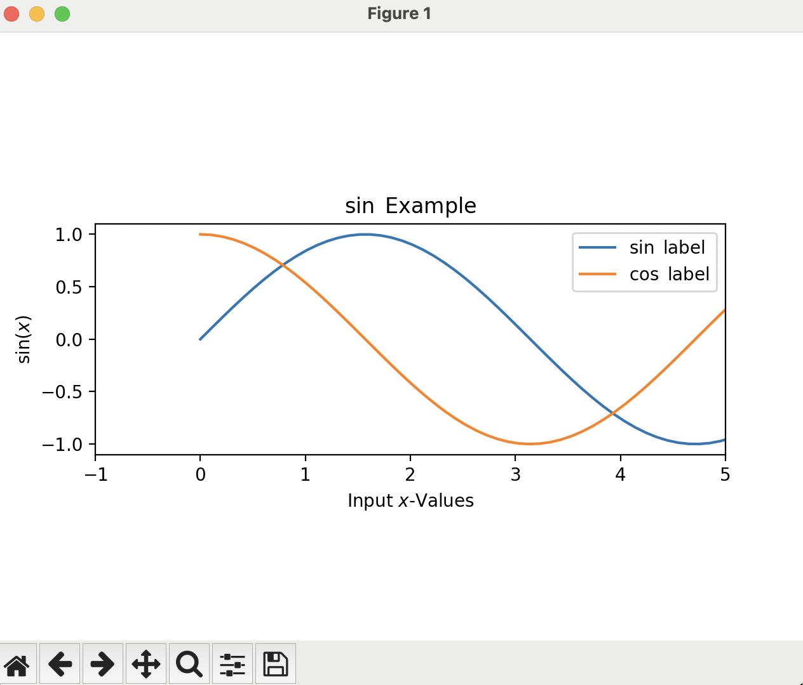
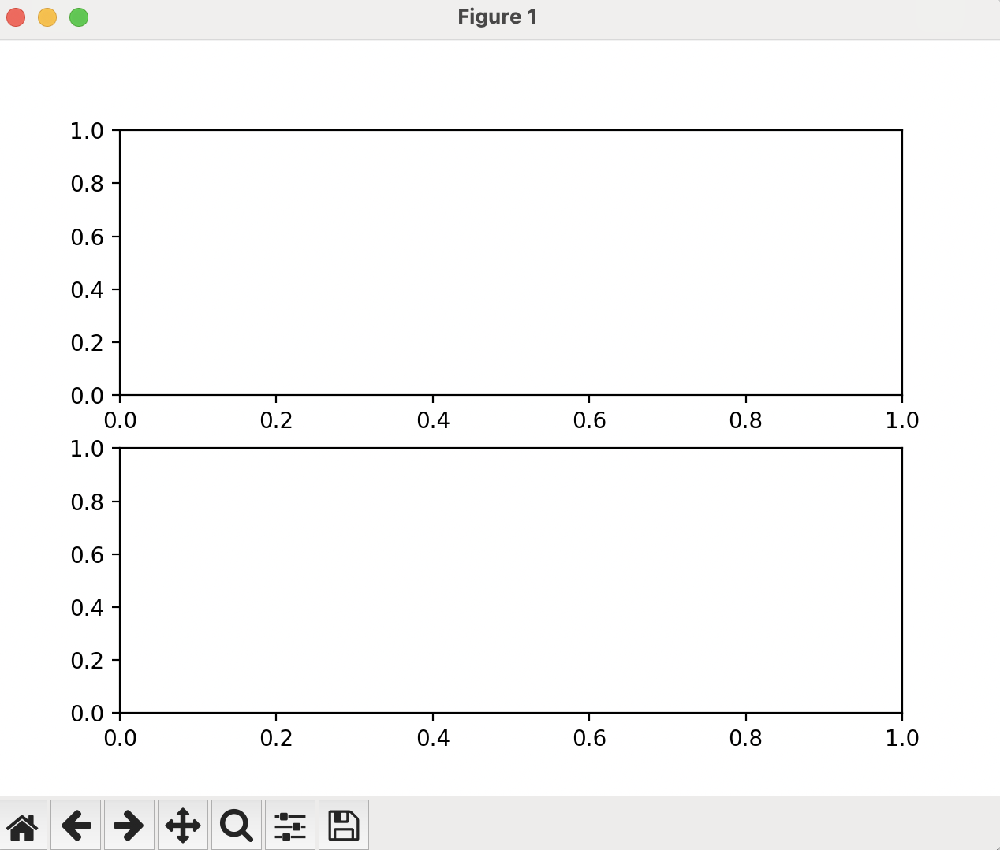
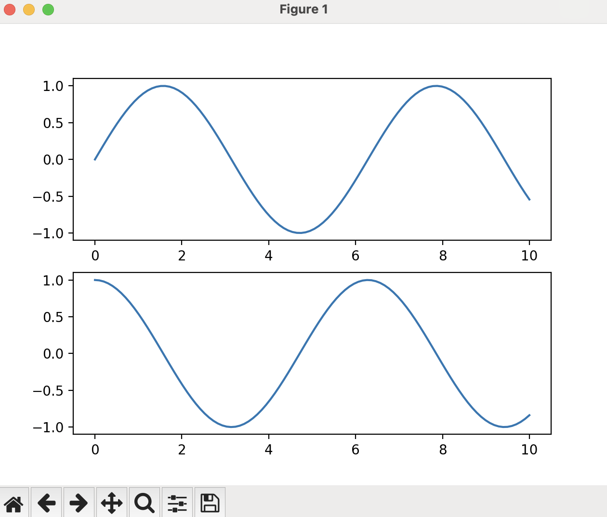
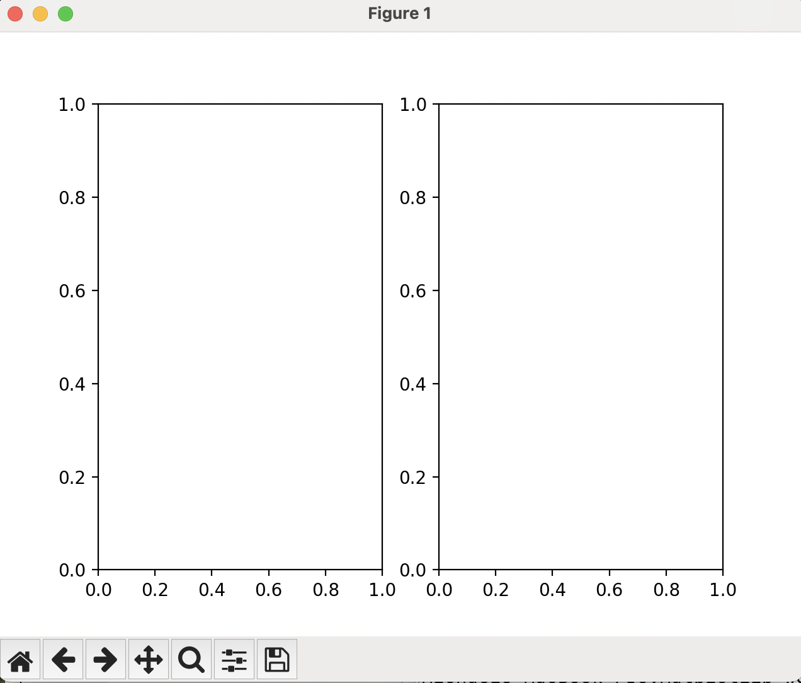
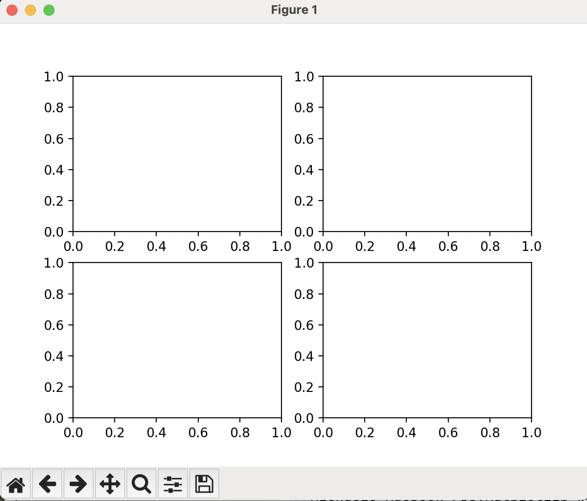
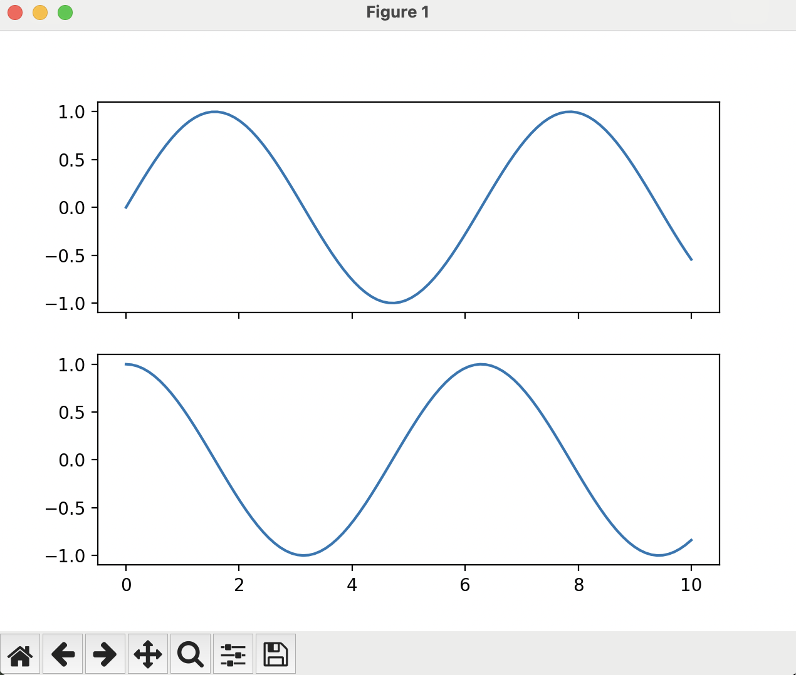
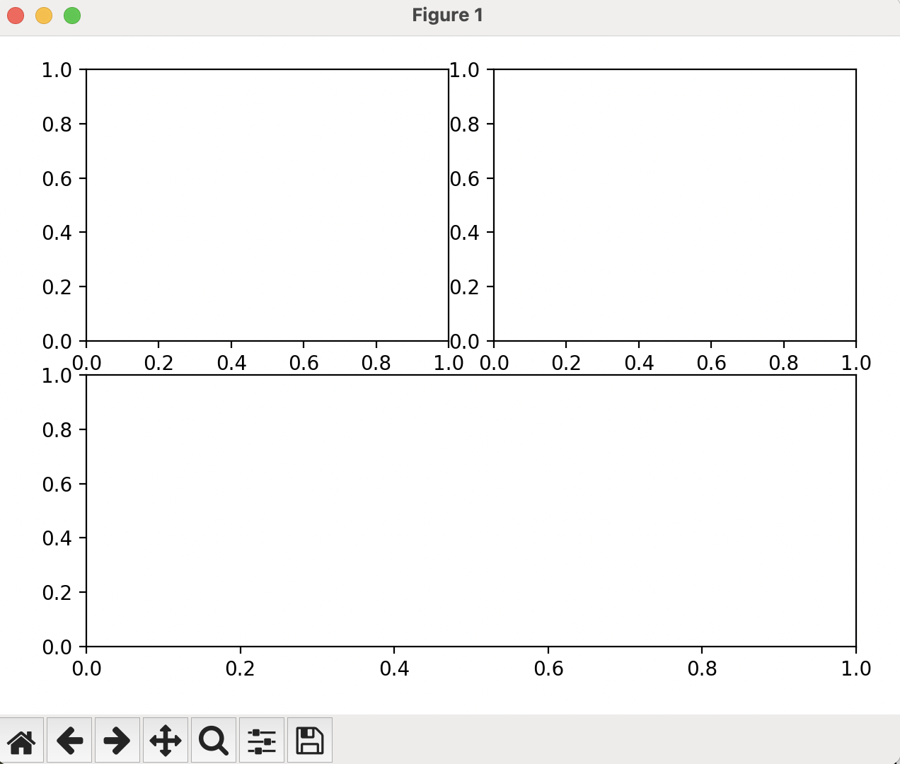
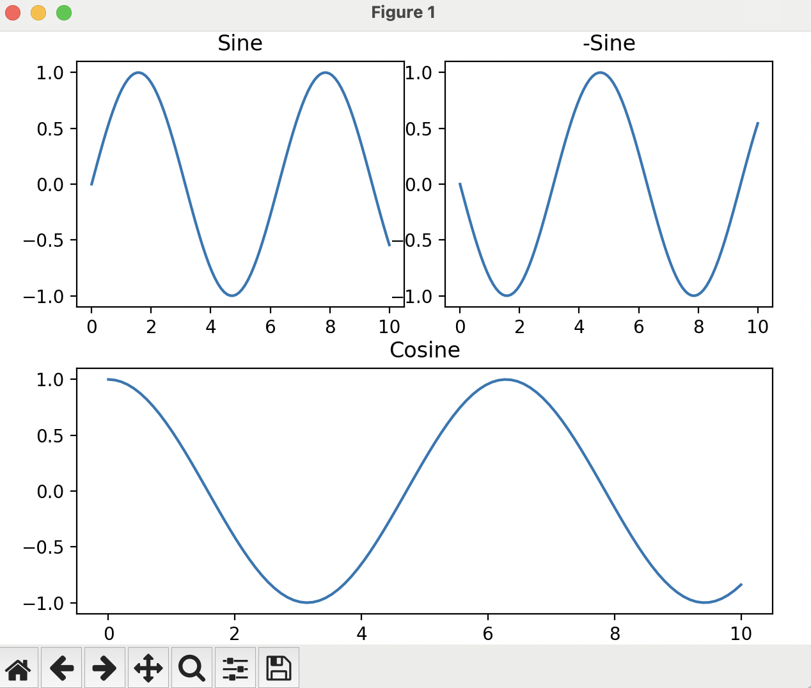

# Advanced Plotting
[Back to main index](index.md){ .md-button }

[Previous page](sine_plot.md){ .md-button .md-button--primary }

## Multiple Lines

What if you want to show multiple datasets on the same figure? Simply add another `ax.plot()` call.

Duplicate your `sine_plot.py` script and name it to be `multi_line.py`. We will work in this new script in this section.

After we generate our first set of y-values, we are going to generate another set of y-values for our second line, using the `cos` function:
```python
y2_values = np.cos(x_values)
```
Now, after the first `ax.plot()` invocation, but before the `plt.show()`, add this line:
```python
ax.plot(x_values,y2_values,label=r'$\cos$ label')
```

Your new script should look like this:
```python
import numpy as np
import matplotlib.pyplot as plt

fig, ax = plt.subplots()
ax.set_aspect(1)
ax.set_title(r'$\sin$ Example')
ax.set_xlabel(r'Input $x$-Values')
ax.set_ylabel(r'$\sin(x)$')
ax.set_xlim([-1,5])

x_values = np.linspace(0,10,100)
y_values = np.sin(x_values)
y2_values = np.cos(x_values)
ax.plot(x_values,y_values,label=r'$\sin$ label')
ax.plot(x_values,y2_values,label=r'$\cos$ label')
ax.legend()
plt.show()
```
Once we run this from the terminal:
```
python multi_line.py
```
We will get a plot that looks like this:


## Styling Lines

What if we do not like the default colors or styles of the lines? We can change them! This styling is done at plotting time, instead of when the figure is created. It is accomplished through styling strings. There are three main options we may be concerned with:

- Markers
- Color
- Line style

We have already seen the first one when we were debugging the first [Sine Plot](./sine_plot.md#plotting-functions). It can set the style of the markers used at each of the points plotted. There are many marker styles available, which can be found [here](https://matplotlib.org/stable/api/markers_api.html).

The color is similarly implemented: we add an option named `color` to the `ax.plot()` command. This also has many options available to it, including most common colors.

Lastly, line style controls how the line is displayed. This option is notated as `linestyle`. There are four main styles, with the option to parameterize your own style as well. The four options are:

- Solid
- Dotted
- Dashed
- Dash dot

Here's the plot invocations for four lines using different stylings for each one:
```python
ax.plot(x_values,y_values,label=r'$\sin$ label',marker='.',color='blue',linestyle='solid')
ax.plot(x_values,y2_values,label=r'$\cos$ label',marker='*',color='orange',linestyle='dotted')
ax.plot(x_values,-y_values,label=r'$-\sin$ label',marker='+',color='black',linestyle='dashed')
ax.plot(x_values,-y2_values,label=r'$-\cos$ label',marker='^',color='green',linestyle='dashdot')
```

If you add these to your `multi_line.py` file, you will get a plot that looks like this:


!!! note "Notice"

    Notice that I resized the plot window to get it to look nicer, as the default layout had the legend overlaying the lines.

## Multiple Plots

What if you had lines that you wanted to put on different axes? We can do that! To do this, create a new script named `Multi_plot.py`. Start by adding the `import` statements to the top:

```python
import numpy as np
import matplotlib.pyplot as plt
```

We can implement multiple axes when we create the figure in the first place. We do this by passing two numbers to the `plt.subplots()` function:

```python
fig, (top_axes,bottom_axes) = plt.subplots(2,1)
```

The first number is the number of vertical plots, and the second number is the number of horizontal plots. By default, if we don't pass anything to the function, it assumes one in each direction, leading to a single plot. Notice as well the parentheses around the two axes. This is how `plt.subplots()` returns the axes, as a list. We could also just assign the axes to a list object and access the different parts via indices, but it is better practice to label each variable holding each axes object.

Add a `plt.show()` to the end without putting any data in to see the formation of the plots. So your `Multi_plot.py` script should look like this:

```python
import numpy as np
import matplotlib.pyplot as plt

fig, (top_axes,bottom_axes) = plt.subplots(2,1)
plt.show()
```

If we run it from the terminal (`python Multi_plot.py`), it will result in a figure that looks like this:


If we want to add data to each of the axes, we can simply do `top_axes.plot()` and `bottom_axes.plot()` commands. If we generate the data as we did before, our script would look like this:

```python
import numpy as np
import matplotlib.pyplot as plt

fig, (top_axes,bottom_axes) = plt.subplots(2,1)

x_values = np.linspace(0,10,100)
y_values = np.sin(x_values)
y2_values = np.cos(x_values)

top_axes.plot(x_values,y_values)
bottom_axes.plot(x_values,y2_values)

plt.show()
```
If we run this with `python Multi_plot.py` in the terminal, it gives us a figure that looks like this:


Now, what if we switch the two and the one in the `plt.subplots()` function? And get rid of the data and the plotting parts of the script:

```python
import numpy as np
import matplotlib.pyplot as plt

fig, (left_axes,right_axes) = plt.subplots(1,2)

plt.show()
```

It stacks the plots horizontally, instead of vertically, like so:


Now, what if we want to have four plots, how would we format the command?

```python
fig, ((top_left, top_right),(bottom_left, bottom_right)) = plt.subplots(2,2)
```

It gives us a figure that looks like this:


## Sharing Axes

There are times where you want plots to have the x- or y-axis span the same amount as other plots you have in your figure. You can do this using the `sharex=True` and `sharey=True` options passed to the `plt.subplots()` function. The invocation could look like this:

```python
import numpy as np
import matplotlib.pyplot as plt

fig, (top_axes,bottom_axes) = plt.subplots(2,1,sharex=True)

x_values = np.linspace(0,10,100)
y_values = np.sin(x_values)
y2_values = np.cos(x_values)

top_axes.plot(x_values,y_values)
bottom_axes.plot(x_values,y2_values)

plt.show()
```

Note that the only change is in the fourth line, where we add the `sharex=True` option to the invocation. If you run this script, try manipulating one of the plots and see what happens. The resultant figure is shown here:



## Non-uniform Layouts

What if we want non-uniorm layouts? Like a figure with two plots on the top and a plot that spans across the bottom? We can use the `fig.add_axes()` function:

```python
fig = plt.figure()
axes   = {"top_left":    fig.add_axes([0.10, 0.55,  0.40, 0.40]),
          "top_right":   fig.add_axes([0.55, 0.55,  0.40, 0.40]),
          "bottom":      fig.add_axes([0.10, 0.05,  0.85, 0.40])}
```

The first two numbers in the list passed to `fig.add_axes()` are the lower left x-y coordinate in terms of the fraction of the whole figure (i.e. the number should span between 0 and 1). The next two numbers are the width and the height (respectively) of the added axes (also in terms of fraction of the figure). The reason that these aren't 0, 0.5, and 1 is that the axes need space for the tick labels (the numbers by the axes). If we run this new configuration of `Multi_plot.py`, we get a plot that looks like this:



Here, to add data to the plots, we would utilize what is called a Python "dictionary". A dictionary in Python is a set of key-value pairs. To access the values, you index the dictionary by the key. The axes variable in the latest configuration is already a dictionary, which you can tell by the curly braces and the colons. The curly braces bookend the set of values, and the colon delimits what the key-value pair is. So, to access the bottom axes, we would use the command: `axes["bottom"]`. From there we could plot, or add limits, labels, or whatever else we desire. Here's an example script that uses the `fig.add_axes()` function:


```python
import numpy as np
import matplotlib.pyplot as plt

fig = plt.figure()
axes   = {"top_left":    fig.add_axes([0.10, 0.55,  0.40, 0.40]),
          "top_right":   fig.add_axes([0.55, 0.55,  0.40, 0.40]),
          "bottom":      fig.add_axes([0.10, 0.05,  0.85, 0.40])}

x_values = np.linspace(0,10,100)
y_values = np.sin(x_values)
y2_values = np.cos(x_values)

axes["top_left"].plot(x_values, y_values)
axes["top_left"].set_title("Sine")

axes["top_right"].plot(x_values, -y_values)
axes["top_right"].set_title("-Sine")

axes["bottom"].plot(x_values, y2_values)
axes["bottom"].set_title("Cosine")

plt.show()
```

When we run this from the terminal, it results in a figure that looks like this:



Notice that in this one, the titles are for each axes, not for the entire figure. Also, notice that some of the tick labels of the upper right plot overlap the plot in the top left. Try playing with the `fig.add_axes()` numbers until it looks better.

## Saving Plots

Up to this point, we have been interactively viewing the plots as we generate them. However, when we close out of the window, they are gone forever (until we run the script again). What if we want to save the plots to a file to have a reproducible view of the plot to put into, say, a paper? There's a simple command for that:

```python
plt.savefig('FigureName.png')
```

Simply replace the `plt.show()` in the script with the `plt.savefig()` function and it will save the file to the same directory the script is in. It supports many options as well as many file types, but for now, saving as a PNG is sufficient for our needs.

Of note, saving a figure does not clear it from memory, so if you save an intermediate figure, you can still plot more on top of it. If you do need to clear a figure of data, use the `plt.clf()` function.

In the next section, we will discuss different types of plots and how to use them:

[Next section](plot_types.md){ .md-button .md-button--primary }
