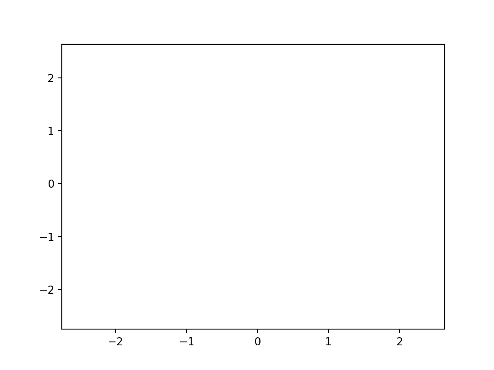
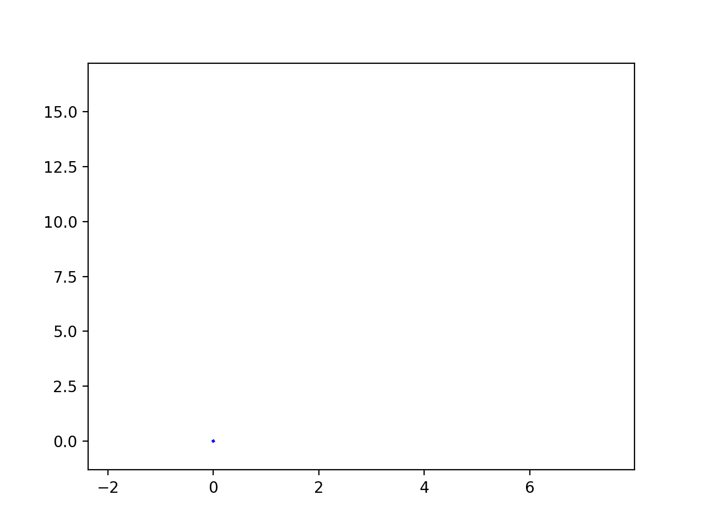
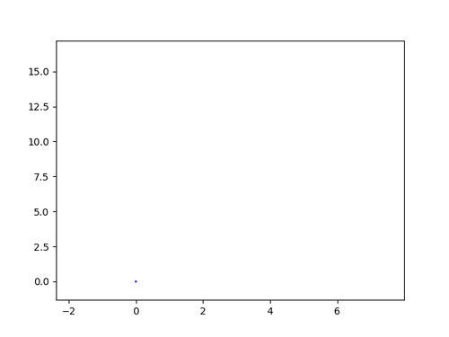

# Animations
[Back to main index](index.md)

[Previous page](plot_types.md)

## Introduction

## FuncAnimation

```
import numpy as np
import matplotlib.pyplot as plt
import matplotlib.animation as animation

num_steps = 100

xs = np.asarray([0])
ys = np.asarray([0])

rng = np.random.default_rng(seed=25)
steps = np.arange(0,num_steps,1)
for step in steps:
    step_angle = 2*np.pi*rng.random()
    step_size = 3*rng.random()
    xs=np.append(xs, step_size*np.cos(step_angle))
    ys=np.append(ys, step_size*np.sin(step_angle))

min_x = np.min(xs)
max_x = np.max(xs)
min_y = np.min(ys)
max_y = np.max(ys)

fig, ax = plt.subplots()

line2 = ax.plot(xs[0], ys[0])[0]
ax.set(xlim=[min_x, max_x], ylim=[min_x, max_x])

def update(frame):
    # update the line plot:
    line2.set_xdata(xs[:frame])
    line2.set_ydata(ys[:frame])
    return (line2)


ani = animation.FuncAnimation(fig=fig, func=update, frames=num_steps, interval=50)
ani.save('animated.gif')
```


## ArtistAnimation

```
import numpy as np
import matplotlib.pyplot as plt
import matplotlib.animation as animation

num_steps = 100

xs = np.asarray([0])
ys = np.asarray([0])

rng = np.random.default_rng(seed=25)
steps = np.arange(0,num_steps,1)
for step in steps:
    step_angle = 2*np.pi*rng.random()
    step_size = 3*rng.random()
    xs=np.append(xs, step_size*np.cos(step_angle))
    ys=np.append(ys, step_size*np.sin(step_angle))

min_x = np.min(xs)
max_x = np.max(xs)
min_y = np.min(ys)
max_y = np.max(ys)

fig, ax = plt.subplots()
ax.set_xlim([min_x,max_x])
ax.set_ylim([min_y,max_y])

artists = []
for step in steps:
    artists.append(ax.plot(xs[:step+1],ys[:step+1], 'b'))

ani = animation.ArtistAnimation(fig=fig, artists=artists, interval=50)

ani.save('artists.gif')
```


## FFmpeg

```
import numpy as np
import matplotlib.pyplot as plt
import os

num_steps = 100

xs = np.asarray([0])
ys = np.asarray([0])

rng = np.random.default_rng(seed=25)
steps = np.arange(0,num_steps,1)
for step in steps:
    step_angle = 2*np.pi*rng.random()
    step_size = 3*rng.random()
    xs=np.append(xs, step_size*np.cos(step_angle))
    ys=np.append(ys, step_size*np.sin(step_angle))

min_x = np.min(xs)
max_x = np.max(xs)
min_y = np.min(ys)
max_y = np.max(ys)

alphas=[1]
lws = [2]
dec = 1.05

for step in steps[1:]:
    fig, ax = plt.subplots()
    alphas.insert(0,alphas[0]/dec)
    lws.insert(0,lws[0]/dec)
    for i in range(step):
        ax.plot(xs[i:i+2],ys[i:i+2],'b',alpha=alphas[i],lw=lws[i])
    ax.set_xlim([min_x,max_x])
    ax.set_ylim([min_y,max_y])
    plt.savefig('ffmpeg%04d.png' % step)
    plt.close()

os.system('ffmpeg -hide_banner -loglevel panic -y -r 15 -f image2 -i figs/ffmpeg%04d.png -vf "scale=500:-1:flags=lanczos,split[s0][s1];[s0]palettegen[p];[s1][p]paletteuse" figs/ffmpeg.gif')
os.system('rm ffmpeg*.png')
```

