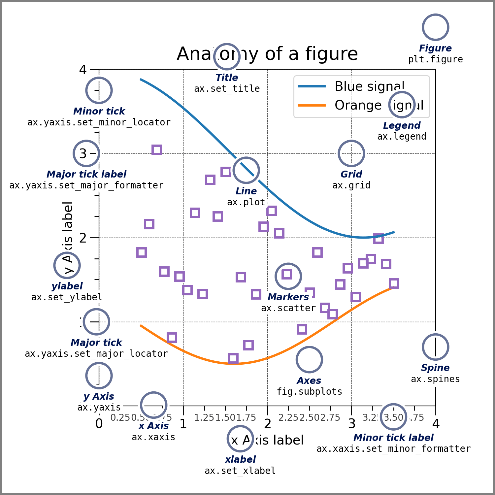
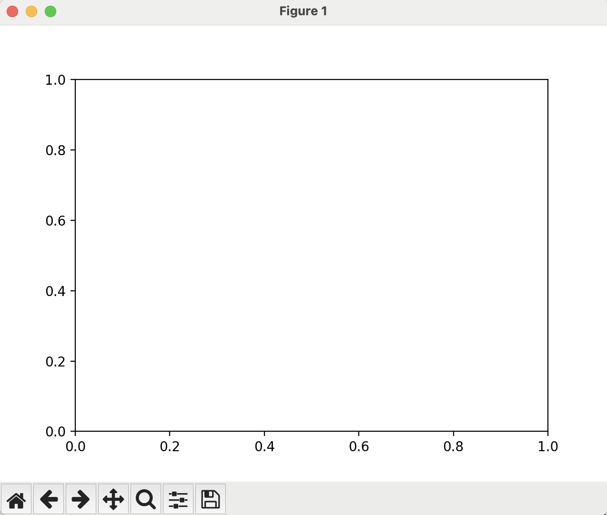
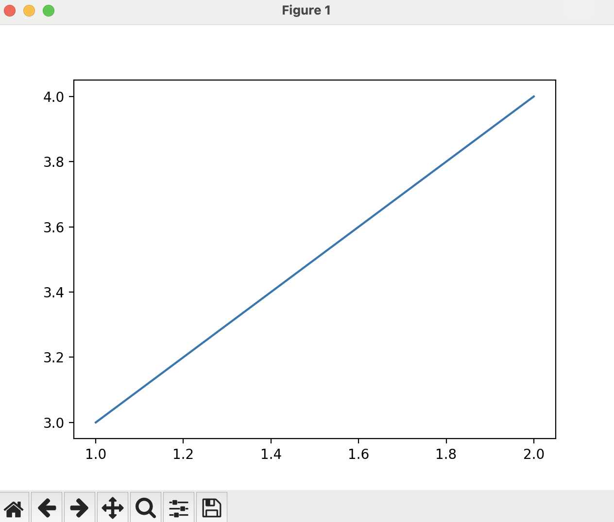
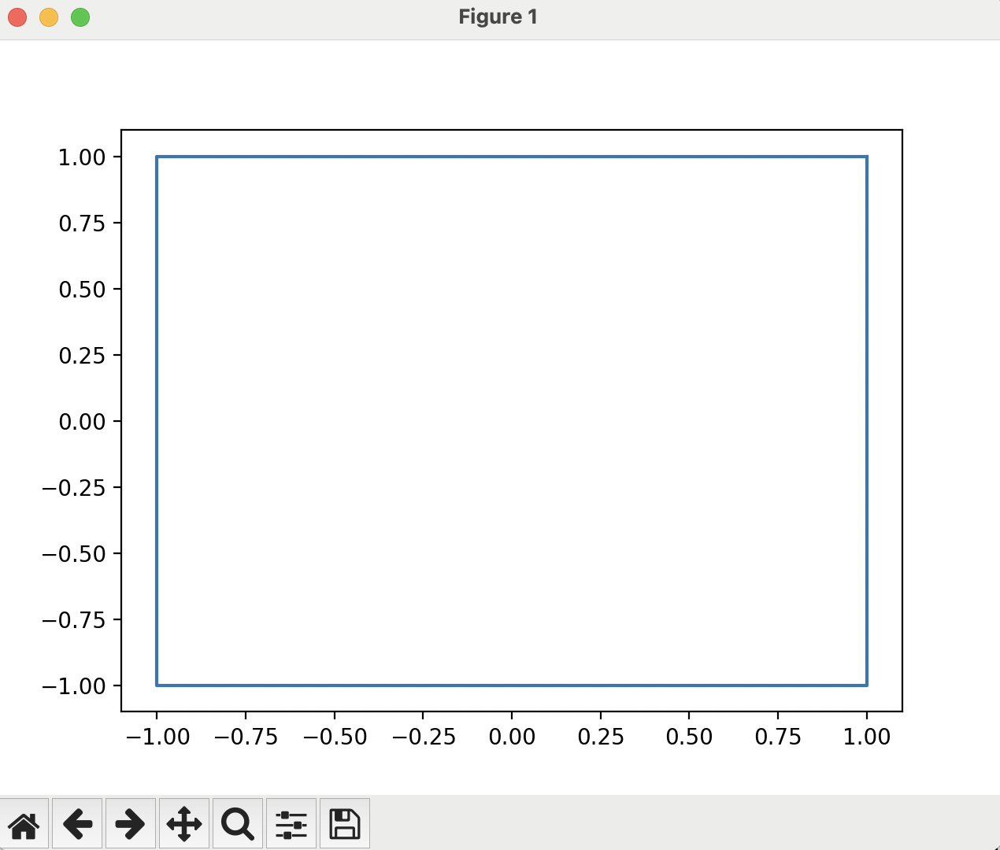
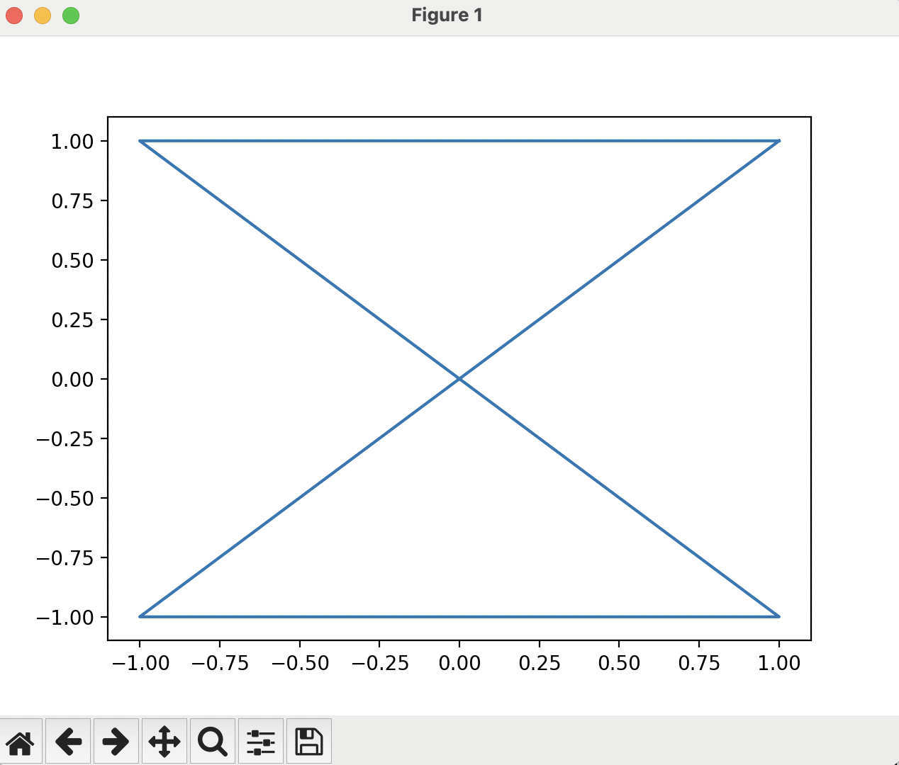

# Our First Script
[Back to main index](index.md){ .md-button }

[Previous page](introduction.md){ .md-button .md-button--primary }

## Beginning Python

While this is not a Python workshop, we need to know some python to fully utilize MatPlotLib. The first part of any python script is the `import` block. This is where we tell the computer which python packages we want this script to use. For our purposes, there are two main packages we want to import:

- NumPy
- MatPlotLib

To do this, let's open a new text file, named 'First_script.py' and add some lines to it:
```python
import numpy as np
import matplotlib.pyplot as plt
```
The `as` modifier gives a 'nickname' to the package so that we do not have to write the entire package name every time we want to use it.

Now, let us run the script. To do this
- Open a terminal
- Navigate to the folder where the script is saved
- Run `python First_script.py`

Ok, if there were not any errors, nothing happened. That is because we did not instruct the computer to tell us anything, or print anything to the screen.

Let us add another line to the script after the `import` statements:
```python
print('Hello World!')
```
And, run it again from the terminal:
```
python First_script.py
```

Hey! It printed 'Hello World!' to the screen, it did something!

This is the main workflow of python scripting:
- Write some code
- Run it
- Edit/improve it
- Run it again
- Repeat until you are satisfied

## Beginning MatPlotLib

Now how about we make some plots! First, get rid of the `print` statement, we do not need it anymore.

In the image below (taken from [MatPlotLib's official website](https://matplotlib.org/stable/users/explain/quick_start.html#parts-of-a-figure)), we can see the many different parts that make up a typical plot made with MatPlotLib.



We will go through many of these as we progress through this workshop.

First, we will make a rudimentary figure, just to show the basics of how building a plot goes. We already have the import statements in our script, which we need to make sure the packages that we want are loaded into our script. Next, we will want to create the figure itself. You can do that by adding this line after the `import`s:

```python
fig, ax = plt.subplots()
```
The command itself uses the `plt` package, which is a nickname for the `matplotlib.pyplot` package, and from that package, runs the `subplots` function with no arguments. What this does is generate a figure with one set of x- and y-axes. The figure is the overall container for the plot and the axes are what contains the plots themselves. Later in this workshop, we will do things with multiple axes in the same figure to combine data for a better overall presentation.

If we run the script at this point, it will again do nothing, as we have not told the computer to show us anything. We have said 'Generate a plot', and that is all. After the script reaches the end of the file, it will automatically destroy any plots it has generated so that it can conserve memory.

We need to add a line to show us the plot after we create it, which is simply:
```python
plt.show()
```
Your script should now look like this:
```python
import numpy as np
import matplotlib.pyplot as plt

fig, ax = plt.subplots()
plt.show()
```

When we run this from the terminal:
```
python First_script.py
```
It will generate the plot and then show us the plot until we exit out of it. This is not very interesting, because it is just a blank figure. But, we were able to make something appear, we are well on our way to making beautiful plots.

You should see something like this:


## My First Plots

To put some data on the plot, you can pass two lists of numbers to a `ax.plot` command that will generate a line on the axes. The two lists are, in order, the x-values and the y-values. In between the `fig, ax = plt.subplots()` and the `plt.show()` lines, please add this line of code:
```python
ax.plot([1,2],[3,4])
```
What this line does is graphs a line on the axes object that we created earlier that goes from the point `(1,3)` to the point `(2,4)`.

Your script should look like this:
```python
import numpy as np
import matplotlib.pyplot as plt

fig, ax = plt.subplots()
ax.plot([1,2],[3,4])
plt.show()
```

And run it from the terminal:
```
python First_script.py
```

You have now generated a graph with some data, which should look like this:


MatPlotLib does not order things by the x- or y-axes, it will plot lines in the order that you pass them to the function. If we change the data we pass to the `ax.plot()` command, it will change what is plotted. Change that line to be:
```python
ax.plot([1,1,-1,-1,1],[1,-1,-1,1,1])
```
Before we run the new script, what do you think it will do? What shape should this be?

??? note "Answer"

    If you guessed a square, you were correct:
    

What if we swap the second and third x-value?
```python
ax.plot([1,-1,1,-1,1],[1,-1,-1,1,1])
```
??? note "Answer"

    If you guessed an hourglass shape, you were correct:
    

MatPlotLib really does just plot lines that connect the points you pass to it.

In the next section, we will talk about plotting functions and styling figures:
[Next Section](sine_plot.md){ .md-button .md-button--primary }
