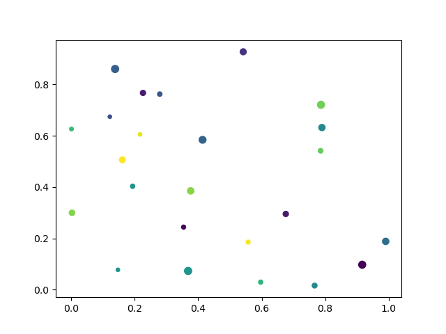

# Types of Plots
[Back to main index](index.md)

[Previous page](adv_plots.md)

In this section, we will talk about different plot types, as well as how and when to use them.

## Plot

This is the plot type we have been doing so far. It plots lines between every point that you supply it, in the order that you supply them to the function. The invocation would look something like this:

```
ax.plot(x,y,label='Label',marker='MarkerType',color='Color',linestyle='Style')
```

Everything after the `x` and `y` are optional, and even the `x` is optional. It will, by default, plot each y-value against the list index of that data point.

## Scatter Plots

What if you have data that you want to plot, but it does not need to be connected by lines? You could simply set the marker on a normal line plot and additionally set `linestyle='None'`. This would plot all of your points without having lines connecting them together.

However, MatPlotLib provides a different function that adds some additional functionality:

```
ax.scatter(x, y, s=sizes, c=colors)
```

This takes the standard x- and y-coordinates, but you also have some extra control on the sizes of the points, as well as the colors of the points. So, you could set points to be larger and more colored depending on the underlying data.

Here's an example script that uses the `ax.scatter()` function:

```
import numpy as np
import matplotlib.pyplot as plt

rng = np.random.default_rng(seed=25)

x = rng.random(24)
y = rng.random(len(x))

sizes = 50*rng.random(len(x))+10
colors = rng.random(len(x))


fig, ax = plt.subplots()

ax.scatter(x, y, s=sizes, c=colors)

plt.show()
```

You could save this script as `Scatter_plot.py` and run it from the terminal. Here, we use a couple new functions. The first comes from NumPy's 'random' module. This lets us generate repeatable, random numbers for our data. The way to do that is to first initialize the randomness: `rng = np.random.default_rng(seed=25)`, then we can use it to generate random numbers between 0 and 1 by calling `rng.random(size)` where `size` is the size of the resultant array. The second is the built-in Python function: `len()`. This simply returns the length of an array or list. An astute observer will notice on line 9, where we generate the sizes, that it has been multiplied by 50 and then 10 is added. This is applied to each element in the generated random array. We do this because the array of sizes is directly converted into pixels, so a small number (0-1) will result in very small point sizes. Whereas, the color array is dynamically set to span the range of the data. If you want to explicitly set the range of colors, you can put the  `vmin=Min, vmax=Max` options into the `ax.scatter()` function (where `Min` and `Max` are replaced with the required minimum and maximum).

When we run the script, it should generate something that looks like this:


## Bar Charts

```
import numpy as np
import matplotlib.pyplot as plt

data = {'Apple': 10, 'Orange': 15, 'Lemon': 5, 'Lime': 20}
names = list(data.keys())
values = list(data.values())

fig = plt.figure()
ax = plt.axes()

ax.bar(names, values);

plt.show()
```

```
import numpy as np
import matplotlib.pyplot as plt

data = {'Apple': 10, 'Orange': 15, 'Lemon': 5, 'Lime': 20}
names = list(data.keys())
values = list(data.values())

fig = plt.figure()
ax = plt.axes()

ax.barh(names, values);

plt.show()
```

```
import numpy as np
import matplotlib.pyplot as plt

men_means = [20, 34, 30, 35, 27]
women_means = [25, 32, 34, 20, 25]

x = np.arange(len(men_means))
width = 0.25

fig, ax = plt.subplots()
rects1 = ax.bar(x - width/2, men_means, width, label='Men')
rects2 = ax.bar(x + width/2, women_means, width, label='Women')

ax.legend()

plt.sshow()

```

## Fill Between

```
import numpy as np
import matplotlib.pyplot as plt

rng = np.random.default_rng(seed=25)

x = np.linspace(0, 8, 16)
y1 = x/2 + 2*rng.random(len(x))-1
y2 = 2*x + 2*rng.random(len(x))-1

# plot
fig, ax = plt.subplots()

ax.fill_between(x, y1, y2, alpha=.5, linewidth=0)
ax.plot(x, (y1 + y2)/2, linewidth=2)

plt.show()
```

## Histograms

```
import numpy as np
import matplotlib.pyplot as plt

rng = np.random.default_rng(seed=25)

x = rng.normal(loc=4,scale=1,size=1000)

fig, ax = plt.subplots()

ax.hist(x, bins=20, linewidth=0.25, edgecolor="white")

plt.show()
```

## Error Bars

```
import numpy as np
import matplotlib.pyplot as plt

rng = np.random.default_rng(seed=25)

x = np.linspace(0,10,20)
y = np.sin(x)
yerr = 0.25*rng.random(len(y))

fig, ax = plt.subplots()

ax.errorbar(x,y,yerr, fmt='o', linewidth=2, capsize=6)
```

## 2-D Pixel Maps

```
import matplotlib.pyplot as plt
import numpy as np

bound = 5

X, Y = np.meshgrid(np.linspace(-bound, bound, 4*bound), np.linspace(-bound, bound, 4*bound))
Z = X + Y**2 + np.sin(X*Y) + 1/X

fig, ax = plt.subplots()

ax.imshow(Z, origin='lower')

plt.show()
```

```
import matplotlib.pyplot as plt
import numpy as np

bound = 5

rng = np.random.default_rng(seed=25)

x = np.sort(2*bound*rng.random(4*bound)-bound)
X, Y = np.meshgrid(x, np.linspace(-bound, bound, 4*bound))
Z = X + Y**2 + np.sin(X*Y) + 1/X

fig, ax = plt.subplots()

ax.pcolormesh(X,Y,Z)

plt.show()
```

## Contour Plots

```
import matplotlib.pyplot as plt
import numpy as np

bound = 5

X, Y = np.meshgrid(np.linspace(-bound, bound, 10*bound), np.linspace(-bound, bound, 10*bound))
Z = X + Y**2 + np.sin(X*Y) + 1/X

levels = np.linspace(Z.min(),Z.max(),10)

fig, ax = plt.subplots()

ax.contour(X,Y,Z, levels=levels)

plt.show()
```

```
import matplotlib.pyplot as plt
import numpy as np

bound = 5

X, Y = np.meshgrid(np.linspace(-bound, bound, 10*bound), np.linspace(-bound, bound, 10*bound))
Z = X + Y**2 + np.sin(X*Y) + 1/X

levels = np.linspace(Z.min(),Z.max(),10)

fig, ax = plt.subplots()

ax.contourf(X,Y,Z, levels=levels)

plt.show()
```

## Quiver Plots

```
import matplotlib.pyplot as plt
import numpy as np

bound = 5

X, Y = np.meshgrid(np.linspace(-bound, bound, 2*bound), np.linspace(-bound, bound, 2*bound))
U = 1/X
V = Y

fig, ax = plt.subplots()

ax.quiver(X,Y,U,V)

plt.show()
```

## Stream Plots

```
import matplotlib.pyplot as plt
import numpy as np

bound = 5

X, Y = np.meshgrid(np.linspace(-bound, bound, 2*bound), np.linspace(-bound, bound, 2*bound))
U = 1/X
V = Y

fig, ax = plt.subplots()

ax.streamplot(X,Y,U,V)

plt.savefig('figs/Stream_plot.png')
```

## Irregular Contour Plots

```
import matplotlib.pyplot as plt
import numpy as np

bound = 5

rng = np.random.default_rng(seed=25)

x = 2*bound*rng.random(20*bound)-bound
y = 2*bound*rng.random(20*bound)-bound
z = x + y**2 + np.sin(x*y) + 1/x
levels = np.linspace(z.min(), z.max(), 10)

fig, ax = plt.subplots()

ax.scatter(x,y,alpha=0.1)
ax.tricontour(x,y,z, levels=levels)

plt.show()
```

In the next section, we will discuss how to make a time-series of plots into an animation, such as a gif. [Next section](animations.md)
