# Types of Plots
[Back to main index](index.md){ .md-button }

[Previous page](adv_plots.md){ .md-button .md-button--primary }

In this section, we will talk about different plot types, as well as how and when to use them.

## Plot

This is the plot type we have been doing so far. It plots lines between every point that you supply it, in the order that you supply them to the function. The invocation would look something like this:

```python
ax.plot(x,y,label='Label',marker='MarkerType',color='Color',linestyle='Style')
```

Everything after the `x` and `y` are optional, and even the `x` is optional. It will, by default, plot each y-value against the list index of that data point.

## Scatter Plots

What if you have data that you want to plot, but it does not need to be connected by lines? You could simply set the marker on a normal line plot and additionally set `linestyle='None'`. This would plot all of your points without having lines connecting them together.

However, MatPlotLib provides a different function that adds some additional functionality:

```python
ax.scatter(x, y, s=sizes, c=colors)
```

This takes the standard x- and y-coordinates, but you also have some extra control on the sizes of the points, as well as the colors of the points. So, you could set points to be larger and more colored depending on the underlying data.

Here is an example script that uses the `ax.scatter()` function:

```python
import numpy as np
import matplotlib.pyplot as plt

rng = np.random.default_rng(seed=25)

x = rng.random(24)
y = rng.random(len(x))

sizes = 50*rng.random(len(x))+10
colors = rng.random(len(x))


fig, ax = plt.subplots()

ax.scatter(x, y, s=sizes, c=colors)

plt.show()
```

You could save this script as `Scatter_plot.py` and run it from the terminal. Here, we use a couple new functions. The first comes from NumPy's 'random' module. This lets us generate repeatable, random numbers for our data. The way to do that is to first initialize the randomness: `rng = np.random.default_rng(seed=25)`, then we can use it to generate random numbers between 0 and 1 by calling `rng.random(size)` where `size` is the size of the resultant array. The second is the built-in Python function: `len()`. This simply returns the length of an array or list. An astute observer will notice on line 9, where we generate the sizes, that it has been multiplied by 50 and then 10 is added. This is applied to each element in the generated random array. We do this because the array of sizes is directly converted into pixels, so a small number (0-1) will result in very small point sizes. Whereas, the color array is dynamically set to span the range of the data. If you want to explicitly set the range of colors, you can put the  `vmin=Min, vmax=Max` options into the `ax.scatter()` function (where `Min` and `Max` are replaced with the required minimum and maximum).

When we run the script, it should generate something that looks like this:


## Bar Charts

MatPlotLib also has the ability to do bar charts. The following three scripts show different ways to utilize the bar chart function.

This first one is a typical bar chart: it has a list of names and a list of values. The `ax.bar()` function takes those two lists and creates a bar chart out of them. The names could be any strings, and the values could be any number.

```python
import numpy as np
import matplotlib.pyplot as plt

data = {'Apple': 10, 'Orange': 15, 'Lemon': 5, 'Lime': 20}
names = list(data.keys())
values = list(data.values())

fig, ax = plt.subplots()

ax.bar(names, values)

plt.show()
```
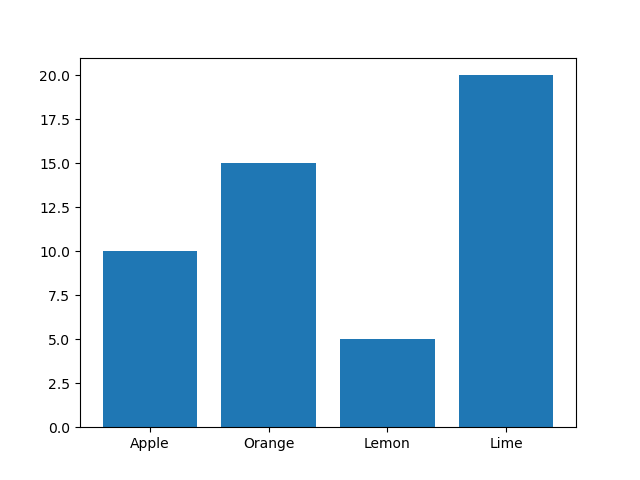

This next script is the exact same as the previous one, with the exception of the actual bar chart function. This time we use `ax.barh()` (notice the 'h' in there), which rotates the bar chart by 90 degrees and makes it a horizontal bar chart.

```python
import numpy as np
import matplotlib.pyplot as plt

data = {'Apple': 10, 'Orange': 15, 'Lemon': 5, 'Lime': 20}
names = list(data.keys())
values = list(data.values())

fig, ax = plt.subplots()

ax.barh(names, values)

plt.show()
```
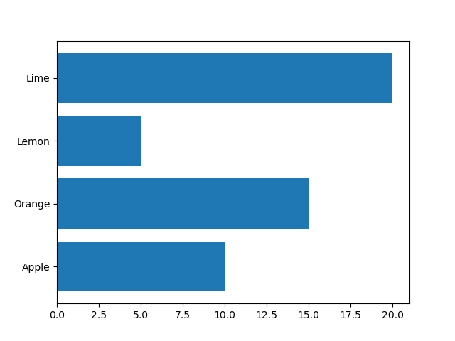

Lastly, we can also do grouped bar charts, by explicitly specifying the x-locations for each of the bars. So here, we have two `ax.bar()` invocations, on for the left bars of each group (the group labeled 'Men') and one for the right bars of each group (the group labeled 'Women'). We could do the same thing horizontally by just changing the bar chart invocations to `ax.barh()` and not changing anything else.

```python
import numpy as np
import matplotlib.pyplot as plt

men_means = [20, 34, 30, 35, 27]
women_means = [25, 32, 34, 20, 25]

x = np.arange(len(men_means))
width = 0.25

fig, ax = plt.subplots()
ax.bar(x - width/2, men_means, width, label='Men')
ax.bar(x + width/2, women_means, width, label='Women')

ax.legend()

plt.show()
```
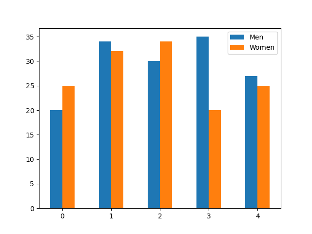

## Fill Between

At times, we may want to create a figure that has an area shaded around a line, or some other feature. We can do this with the `ax.fill_between()` function. It takes as input a list of x-values and then two lists of y-values, one for the bottom of the area and one for the top of the area. In the script below we create two random lines, and then in the figure, shade the area between the two. We also add a line that is halfway between the shaded area.

This script also introduces two new options that we can specify to plots:

- Alpha
- Linewidth

Alpha controls how transparent the object is and ranges from 0 (completely transparent) to 1 (completely opaque). Linewidth controls the width of the plotted line. In the `fill_between()` invocation, we set the line width to be 0 to get rid of any lines it may plot and just have the filled area shown. In the `plot()` invocation afterwards, we set the linewidth to 2 so that it is a thicker line.

```python
import numpy as np
import matplotlib.pyplot as plt

rng = np.random.default_rng(seed=25)

x = np.linspace(0, 8, 16)
y1 = x/2 + 2*rng.random(len(x))-1
y2 = 2*x + 2*rng.random(len(x))-1

# plot
fig, ax = plt.subplots()

ax.fill_between(x, y1, y2, alpha=.5, linewidth=0)
ax.plot(x, (y1 + y2)/2, linewidth=2)

plt.show()
```
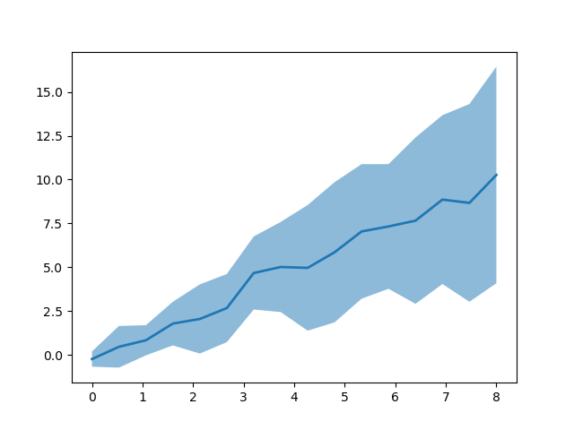

!!! note "Notice"

    This script also introduces layering. In MatPlotLib, plotted objects are layered on top of one another. See what changes with the figure if you change the order of the `fill_between()` and the `plot()` functions. There are ways to set or modify the order in which things are plotted on the figure, but that is beyond the scope of this workshop. If interested, search for 'matplotlib zorder'.

## Histograms

MatPlotLib can also do histograms with its `ax.hist()` function. It takes a list of numbers and plots the frequency of each number in a specified number of bins. In the following script, we use NumPy's random normal distribution to create a plot that is more interesting to see than a rectangle. In the `ax.hist()` command, we pass the list of numbers we want the distribution of. Then, we specify the number of bins we want to display. Next is the line width that we discussed earlier, which affects the outline of each of the bins. Lastly, we specify the edge color, which is the color of the line that surrounds each bin.

```python
import numpy as np
import matplotlib.pyplot as plt

rng = np.random.default_rng(seed=25)

x = rng.normal(loc=4,scale=1,size=1000)

fig, ax = plt.subplots()

ax.hist(x, bins=20, linewidth=0.25, edgecolor="white")

plt.show()
```
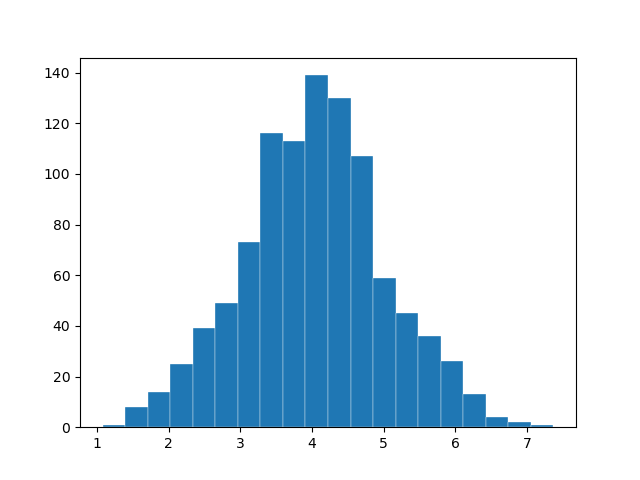

## Error Bars

At times, you may want to have error bars around your data points. To do this in a plot, we can use the `ax.errorbar()` function. It takes three inputs to make `ax.errorbar()` work: the first two are the x-y coordinates of your data points, then the last input is the ± error on each of those points in the y-direction. We additionally specify some options to make the plot look nicer. By default, the points of an `ax.errorbar()` figure are connected by a line. If we set the format option (`fmt`) to be `'o'` this will stop it from plotting lines, and instead plot each point by itself, like a scatter plot instead. Next is the line width, which affects the width of the error bars. Lastly we set the cap size, which is the size of the caps on the top and bottom of the error bars.

```python
import numpy as np
import matplotlib.pyplot as plt

rng = np.random.default_rng(seed=25)

x = np.linspace(0,10,20)
y = np.sin(x)
yerr = 0.25*rng.random(len(y))

fig, ax = plt.subplots()

ax.errorbar(x,y,yerr, fmt='o', linewidth=2, capsize=6)

plt.show()
```
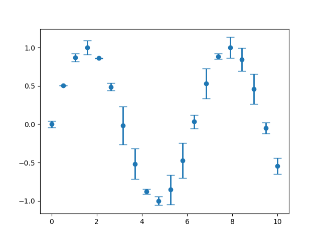

!!! note "Information"

    If your data needs error bars in the x-direction, you can specify the list of x-errors after the `yerr` entry. So the invocation would look like this: `ax.errorbar(x, y, yerr, xerr, OPTIONS)`.

## 2-D Pixel Maps

What if we want to plot a heat map? There are two main ways to do so:

- Imshow
- Pcolormesh

Imshow is much faster than Pcolormesh, but it also has more limitations. Imshow treats every data point like a pixel, and each pixel is the same size; it assumes a uniform, regular grid of points as an input. In the following script, we use a new NumPy function: `np.meshgrid()`. It takes at least two 1D NumPy arrays (vectors) and creates N, N-D matrix of points that correspond to the input vectors. In this case, we want to generate two matrices that correspond to the x- and y-directions. So, if we had two vectors: `[1,2]` (x) and `[3,4]` (y), and we called `np.meshgrid(x,y)` on them, it would give us two matrices as output:

<table>
  <caption>X</caption>
  <tbody>
    <tr><td>1</td><td>2</td></tr>
    <tr><td>1</td><td>2</td></tr>
  </tbody>
</table>
<table>
  <caption>Y</caption>
  <tbody>
    <tr><td>3</td><td>3</td></tr>
    <tr><td>4</td><td>4</td></tr>
  </tbody>
</table>

We can then do mathematical operations on those matrices and get a N-D matrix back.

```python
import matplotlib.pyplot as plt
import numpy as np

bound = 5

X, Y = np.meshgrid(np.linspace(-bound, bound, 4*bound), np.linspace(-bound, bound, 4*bound))
Z = X + Y**2 + np.sin(X*Y) + 1/X

fig, ax = plt.subplots()

ax.imshow(Z, origin='lower')

plt.show()
```
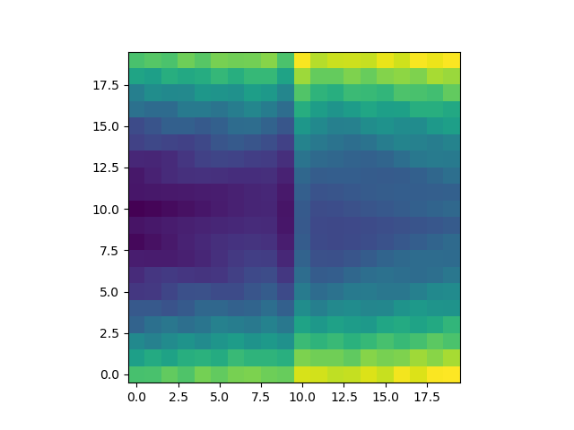

In the previous script, we did not pass the `X` and `Y` matrices to the `ax.imshow()` function, because it does not use them. We did pass an option `origin` that specifies where the matrix should start. By default, the data point at index `[0,0]` is plotted at the top left, and the last data point is the bottom right. If we pass `'lower'` to the `origin` option, this says that the index `[0,0]` is plotted at the bottom left, and the last data point is the top right.

Also notice that the bounds of our data are from -5 to 5, but that the figure does not reflect that. It takes the number of data points as pixels as the x- and y-coordinates. We can however pass the `extent` option to `ax.imshow()` to specify the bounds of the data. That takes the form of `extent=[left, right, bottom, top]`, so in our case it would be `extent=[-5, 5, -5, 5]`.

Imshow can also use different interpolation methods to smooth the data to make it look less pixelated. Something that we do not get into in the workshop.

The next script uses Pcolormesh, which is slower, but can handle non-uniform grids. Pcolormesh takes the same Z data matrix made from NumPy's `meshgrid()` function, but it also requires the X and Y matrices to specify where the points are. Notice that the x-vector is made from ascending random numbers, so that it is not uniformly distributed.

```python
import matplotlib.pyplot as plt
import numpy as np

bound = 5

rng = np.random.default_rng(seed=25)

x = np.sort(2*bound*rng.random(4*bound)-bound)
X, Y = np.meshgrid(x, np.linspace(-bound, bound, 4*bound))
Z = X + Y**2 + np.sin(X*Y) + 1/X

fig, ax = plt.subplots()

ax.pcolormesh(X,Y,Z)

plt.show()
```
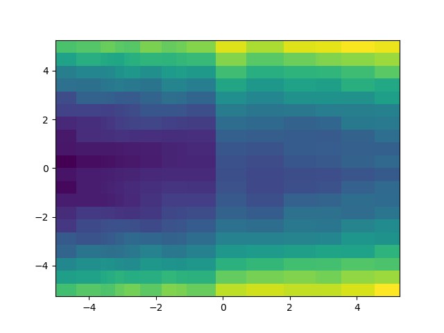

## Contour Plots

At times, we may want to show contours on our heat maps, to show the different levels of 2-dimensional data. There are two main ways to do this:

- `ax.contour()`
- `ax.contourf()`

These both create contour plots, but `ax.contourf()` fills the contour levels, whereas `ax.contour()` leaves the space between contours empty.

They both take three necessary inputs: 2D X- and Y- coordinate matrices, as well as a 2D data matrix that contains the 'height' of each x-y coordinate pair. There is one important option that you may consider adding to the contour invocation: `levels`, which controls where (and how many) contour levels there are. In the following scripts, we set a variable `levels` to be an evenly-spaced array of 10 values that span from the data minimum to the data maximum. Thus, our contour plots will have 10 contour levels that are evenly spaced throughout the data. You could also do a logarithmic set of levels, or something completely different.

```python
import matplotlib.pyplot as plt
import numpy as np

bound = 5

X, Y = np.meshgrid(np.linspace(-bound, bound, 10*bound), np.linspace(-bound, bound, 10*bound))
Z = X + Y**2 + np.sin(X*Y) + 1/X

levels = np.linspace(Z.min(),Z.max(),10)

fig, ax = plt.subplots()

ax.contour(X,Y,Z, levels=levels)

plt.show()
```
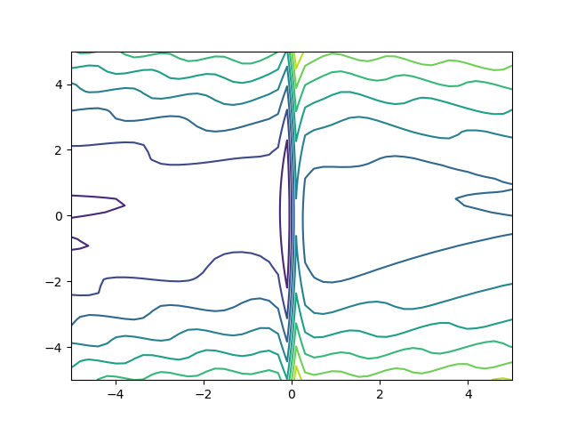

In the next script, which uses the filled contour plot invocation, we add a couple of extra lines to create a color bar, showing the value of each contour level. To do this, we need to save the `ax.contourf()` invocation into a variable, so the color bar knows which plot to use for its values. Then, we add a color bar to the figure with the `fig.colorbar()` function. It takes the `contourf` variable that we just set, and we assign the color bar we just created to be its own variable. We can then manipulate the variable and do things like set the color bar label to whatever we want.

```python
import matplotlib.pyplot as plt
import numpy as np

bound = 5

X, Y = np.meshgrid(np.linspace(-bound, bound, 10*bound), np.linspace(-bound, bound, 10*bound))
Z = X + Y**2 + np.sin(X*Y) + 1/X

levels = np.linspace(Z.min(),Z.max(),10)

fig, ax = plt.subplots()

cfax = ax.contourf(X,Y,Z, levels=levels)

cbar = fig.colorbar(cfax)
cbar.set_label('Colorbar Label')

plt.show()
```
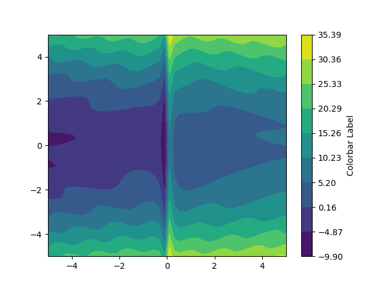

## Quiver Plots

What if we want to show a 2D vector field? We can create a quiver plot to show the direction and magnitude of a field at predefined points. To do this, we use the `ax.quiver()` function that takes four 2D matrices as input. The first two are the 2D X- and Y-coordinate matrices, then the next two are the 2D X- and Y-velocity matrices, that show where the arrows should point and with what length. There are many options to modify the behavior of the quiver plot, such as changing the scaling of the arrows, which you can look at here: [MatPlotLib quiver plot reference](https://matplotlib.org/stable/api/_as_gen/matplotlib.axes.Axes.quiver.html#matplotlib.axes.Axes.quiver)

```python
import matplotlib.pyplot as plt
import numpy as np

bound = 5

X, Y = np.meshgrid(np.linspace(-bound, bound, 2*bound), np.linspace(-bound, bound, 2*bound))
U = 1/X
V = Y

fig, ax = plt.subplots()

ax.quiver(X,Y,U,V)

plt.show()
```
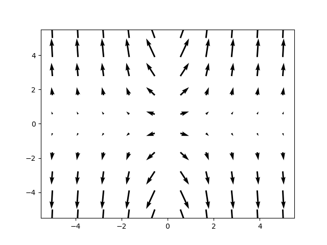

## Stream Plots

Another way of showing a 2D vector field is with a stream plot. This is achieved with the `ax.streamplot()` function, the invocation of which is similar to that of `ax.quiver()`. It takes the same four inputs, but it creates arrow streams that show the path a particle would take if it started on a stream line.

```python
import matplotlib.pyplot as plt
import numpy as np

bound = 5

X, Y = np.meshgrid(np.linspace(-bound, bound, 2*bound), np.linspace(-bound, bound, 2*bound))
U = 1/X
V = Y

fig, ax = plt.subplots()

ax.streamplot(X,Y,U,V)

plt.show()
```
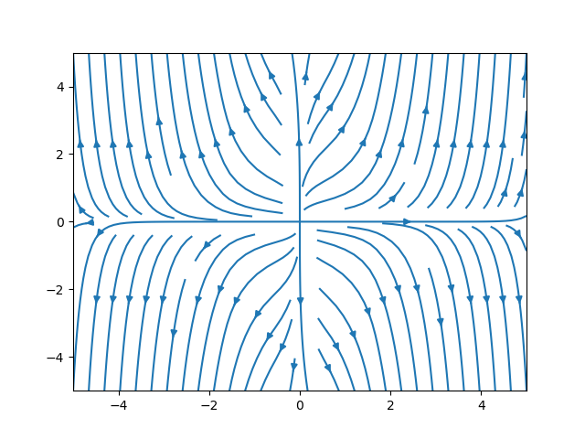

## Irregular Contour Plots

The last type of plot we show in this section is a different kind of contour plot. It is meant for when you have data that you want contours of, but the data is laid out in an irregular manner. It uses triangulation to determine where the contours should go based on the irregularly-spaced data. In the following script, we create two 1-dimensional vectors that contain x- and y-coordinates for our data. We then evaluate our function at each of those points. The contour levels are evenly spaced between the extent of the data (using `np.linspace`). Lastly, we use two plot types: `scatter` and `tricontour` to first, show where our data points are, and second, to generate the actual contours.

```python
import matplotlib.pyplot as plt
import numpy as np

bound = 5

rng = np.random.default_rng(seed=25)

x = 2*bound*rng.random(20*bound)-bound
y = 2*bound*rng.random(20*bound)-bound
z = x + y**2 + np.sin(x*y) + 1/x
levels = np.linspace(z.min(), z.max(), 10)

fig, ax = plt.subplots()

ax.scatter(x,y,alpha=0.1)
ax.tricontour(x,y,z, levels=levels)

plt.show()
```
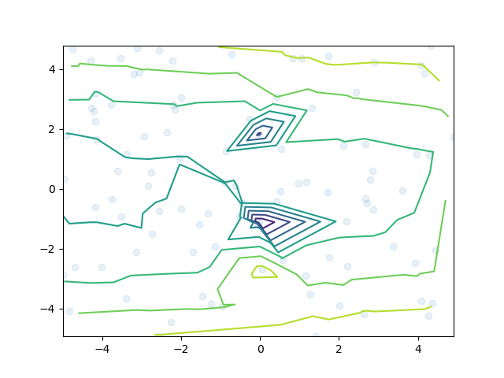

Notice that the contour plot here is not as nice as the ones we [showed above](#contour-plots). This is because it does not have the same extent of data to work with, and the singularity at `x=0` throws things off here if data points get to close to 0.

In the next section, we will discuss different colormaps for our 2D data.

[Next section](colormaps.md){ .md-button .md-button--primary }
