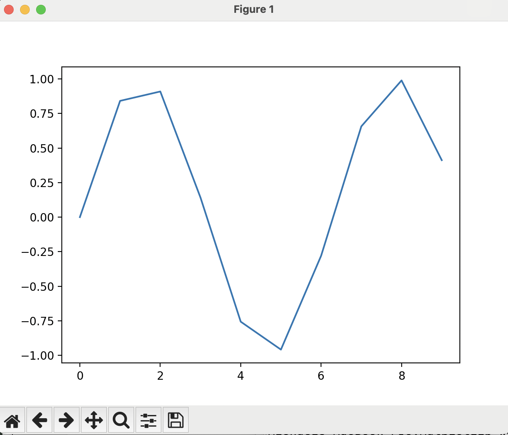
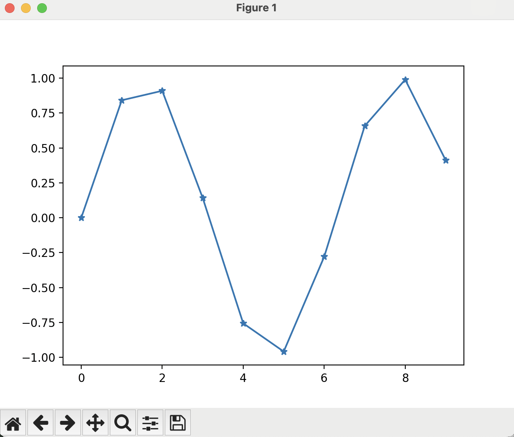
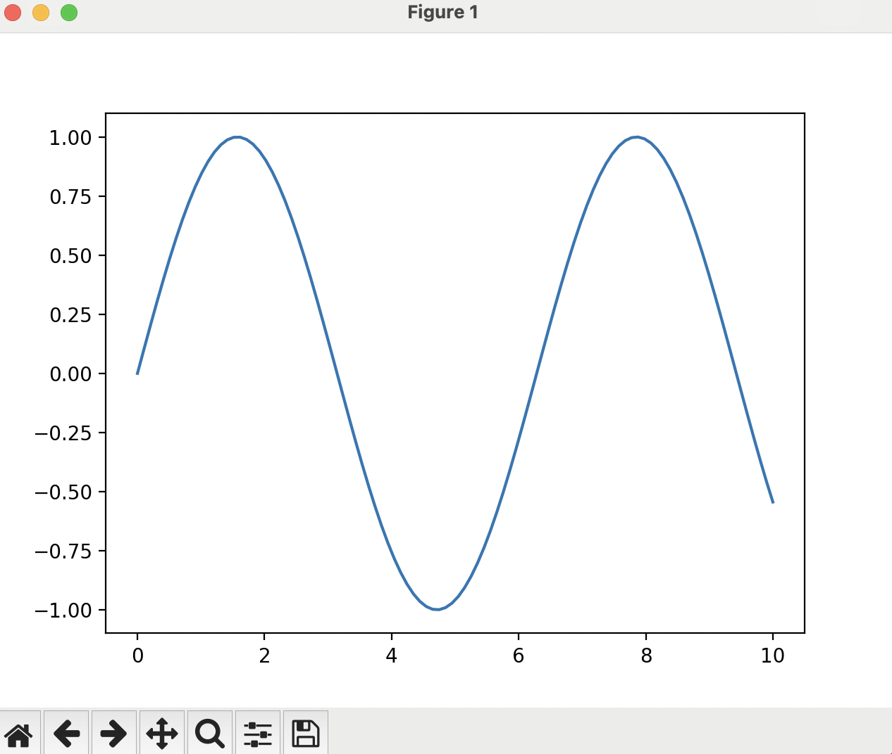
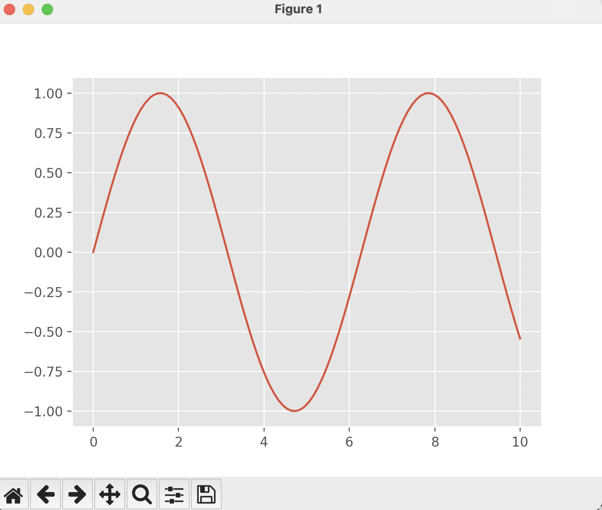
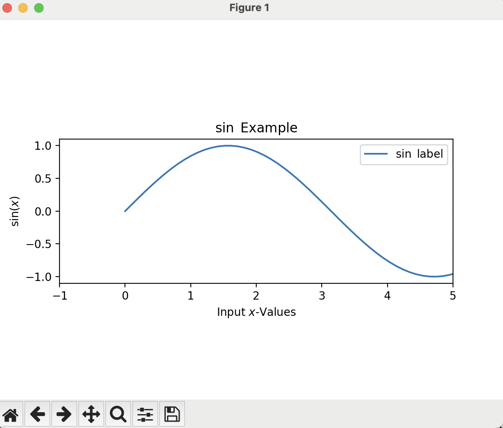

# Our Next Script
[Back to main index](index.md)

[Previous page](first_script.md)

## Plotting Functions

Now, we will plot some actual functions in MatPlotLib. First, we will start with a sine wave. To do this, create a new script named `Sine_plot.py` and put in the normal `import` statements:
```
import numpy as np
import matplotlib.pyplot as plt
```
Then add the figure creation command:
```
fig, ax = plt.subplots()
```

Next, we need to generate the data. To do this, we will use a python built-in function, `range`, that creates a list of ascending integers:
```
x_values = range(10)
```
Now that we have our x-values, we need to calculate our y-values in a pythonic way:
```
y_values = [np.sin(x) for x in x_values]
```
This is called list comprehension. It is essentially a for-loop, where it loops through all the values in a list. Then, we call the NumPy sine function on each of those values and store them into another list, called `y_values`. Last, we want to plot the values we have, and show the plot we generated:
```
ax.plot(x_values,y_values)
plt.show()
```
Your script should look like this at the end:
```
import numpy as np
import matplotlib.pyplot as plt

fig, ax = plt.subplots()
x_values = range(10)
y_values = [np.sin(x) for x in x_values]
ax.plot(x_values,y_values)
plt.show()
```
After we run the new script from the terminal:
```
python Sine_plot.py
```
We should get a plot that looks like this:


However, that looks rather jagged. To get an idea of what is happening, we can add markers to the points that are plotted by adding an option to the `ax.plot()` command:
```
ax.plot(x_values,y_values,marker='*')
```



What can we do to improve the smoothness of the plot? The way to do this is to increase the number of points plotted. Right now, we are just plotting the integers from 0 to 9, but we want to plot some points in between. We could manually add points to a list for the x-values, but there is a better way: using NumPy's `linspace` function. It generates a NumPy array (which is easier to manipulate with math functions than a list), with three imputs to the function. They are, in order, the starting number, the ending number, and the number of points to make up the range. Modify the `x_values` assignment to use the NumPy `linspace` function like so:
```
x_values = np.linspace(0,10,100)
```
This makes a list between 0 and 10 with 100 points along the way. Now, we can simplify the `y_values` assignment because the x_values is now a NumPy array:
```
y_values = np.sin(x_values)
```
We do not need to do list comprehension anymore, because NumPy does it for us. We can also get rid of the `marker='*'` option. Now, we run the script from the terminal:
```
python Sine_plot.py
```

And get a plot that looks like this:


That is much smoother now!

## Styling Plots

Now that we can generate plots and graph data on them, we will talk about how to make them look pretty. We will go into more depth later in this workshop, but here are some high-level options we can use.

First, we can talk about global style sheets. These are overall packaged styles that affect the entire script. To change all plots in the script to look like figures made with R's ggPlot package use the command:
```
pyplot.style.use('ggplot')
```
After the import statements and before the figure creation.

Doing this in our `Sine_plot.py` script yields a plot that looks like this:


You can see all available style sheets by running this command:
```
print(plt.style.available)
```

## Formatting Plots

Now, there are a few other MatPlotLib functions we may want to use to make our plot more readable and useful, such as:

- Aspect Ratio
- Title
- Axis Labels
- Axis Limits
- Legend

These are all set and used after the figure you are trying to modify has been created, but before you show it.

The aspect ratio controls how the x- and y-axes relate to each other within the plot. For this case, we will want that to be one, but it could be the default automatic setting, or something completely different. To explicitly set the aspect ratio of a plot, use this command (which sets the aspect ratio to one):
```
ax.set_aspect(1)
```

Next, the title is text that appears above the axes, which may not be the entire figure, as we will discover when we start putting multiple axes in the same figure. To set this for the axes in question, run the command:
```
ax.set_title(r'$\sin$ Example')
```
Notice the dollar signs in the title? That tells MatPlotLib to use LaTeX math notation, so you can do formulas and such in the different labels of the figure. The `r` in front of the string says to Python to ignore any escape sequences (started by the `\\`) so it can be passed to the LaTeX parser instead of Python trying to interpret it itself. It is generally good practice to include the `r` before the string if you are doing any kind of math in the string.

The axis labels are labels that are put next to each of the x- and y-axes:
```
ax.set_xlabel(r'Input $x$-Values')
ax.set_ylabel(r'$\sin(x)$')
```
Again, we have the dollar signs in the labels, to convert those symbols to their math counterparts.

The axis limits set the extent for each of the axes, or in other words, what the x-y bounds of the plot are:
```
ax.set_xlim([-1,5])
```
This will set the extent of the x-axis to go from -1 to 5. Notice that we did not specify a y-axis limit, by default, MatPlotLib will choose some bound that will encapsulate all of the plotted data, however it can be helpful to explicitly set the bounds.

Lastly, the legend can differentiate between the different lines on a plot, especially when there are many. To use the legend, there are two parts: the line label, and the legend invocation. The line label is added to the `ax.plot()` function, and the legend invocation is added after all the plotting is done:
```
ax.plot(x_values,y_values,label=r'$\sin$ label')
ax.legend()
```

Putting these all together, your script should look like this:
```
import numpy as np
import matplotlib.pyplot as plt

fig, ax = plt.subplots()
ax.set_aspect(1)
ax.set_title(r'$\sin$ Example')
ax.set_xlabel(r'Input $x$-Values')
ax.set_ylabel(r'$\sin(x)$')
ax.set_xlim([-1,5])

x_values = np.linspace(0,10,100)
y_values = np.sin(x_values)
ax.plot(x_values,y_values,label=r'$\sin$ label')
ax.legend()
plt.show()
```
After we run this script from the terminal:
```
python Sin_plot.py
```
We should get a plot that looks like this:


Notice that now the plot is no longer square, as the aspect ratio and the plot limits have dictated that the plot is longer in the x-direction than it is in the y-direction.

In the next section we will talk about some more advanced plotting topics, such as line styling and multiple lines:
[Next Section](adv_plots.md)
